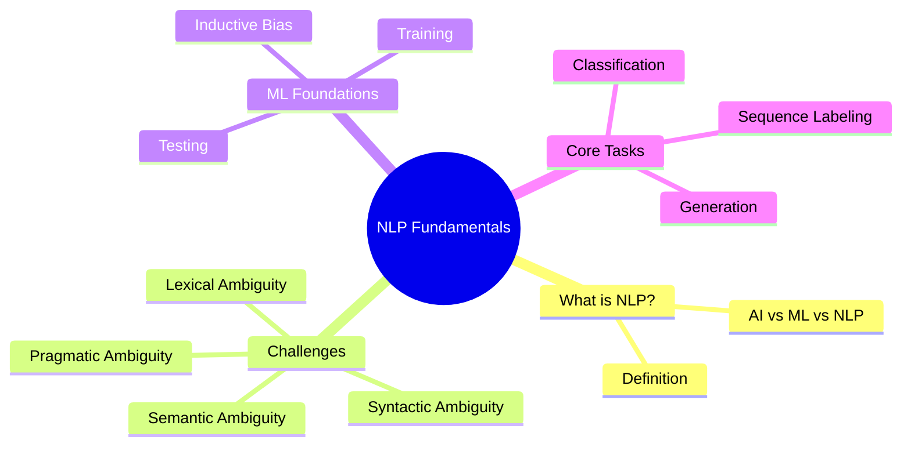

# 01. NLP Fundamentals

## 1. Topic Overview
Language is inherently messy. It breaks rules, relies heavily on unspoken context, and constantly invents new words. That makes processing it computationally brutal. 

This module strips away the hype and introduces exactly what Natural Language Processing (NLP) actually is. We cover why human language breaks traditional parsers, and the specific machine learning paradigms engineers use to force computers to understand text.

## 2. Learning Path
1. [What is NLP?](what-is-nlp.md)
2. [Challenges in NLP](challenges-in-nlp.md)
3. [Machine Learning Foundations](machine-learning-foundations.md)
4. [Core NLP Tasks](core-nlp-tasks.md)
5. [NLP Applications & Pipeline](nlp-applications.md)

## 3. Real-World Applications
- **Spam Filtering**: Automatically detecting malicious emails.
- **Machine Translation**: Google Translate.
- **Virtual Assistants**: Siri and Alexa mapping voice to text and text to intent.

## 4. Difficulty & Importance
- **Mathematical Difficulty**: ★☆☆☆☆ (Purely conceptual)
- **Implementation Difficulty**: ★☆☆☆☆ (No coding required)
- **Exam Importance**: **High**. Expect short-answer and conceptual questions asking you to define ambiguity or categorize an application into a core task.

## 5. Prerequisites
- Basic understanding of what a computer program is.

## 6. External Resources
- 📘 **Textbook**: *Speech and Language Processing* (Jurafsky & Martin), Chapter 1.
- 🎓 **Course**: Stanford CS224N (Introduction to NLP).

---

### Can You Explain This?
- [ ] I can define NLP and distinguish it from Computational Linguistics.
- [ ] I can give a concrete example of the 4 types of ambiguity.
- [ ] I can explain the difference between a Training set and a Test set.
- [ ] I can categorize standard products (like Google Translate) into their underlying NLP task paradigm.
