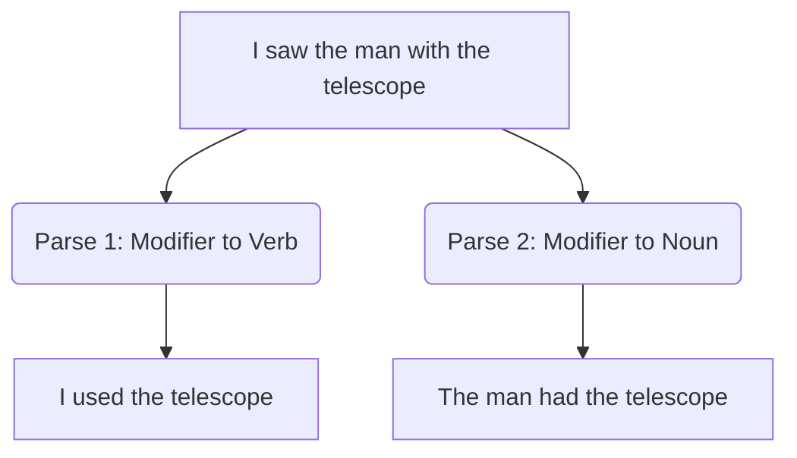

# Challenges in NLP

## 1. Why Natural Language is Difficult
Human language evolved for efficient communication between intelligent beings with shared world knowledge. It did not evolve for computers. Because humans share so much context, we compress our language, leaving out details the listener can infer. Computers lack this shared world knowledge.

## 2. Ambiguity
Ambiguity is the central challenge of NLP. It occurs when a single linguistic construct has multiple valid interpretations.

### Types of Ambiguity
1. **Lexical Ambiguity (Word Level)**
   - *Example*: "I went to the **bank**." (Financial institution vs. River edge).
2. **Syntactic Ambiguity (Grammar Level)**
   - *Example*: "I saw the man with the telescope."
   - *Parse 1*: I used a telescope to see the man.
   - *Parse 2*: I saw a man who possessed a telescope.
3. **Semantic Ambiguity (Meaning Level)**
   - *Example*: "The car hit the pole while it was moving." (What was moving? The car or the pole?)
4. **Pragmatic Ambiguity (Intent Level)**
   - *Example*: "Can you pass the salt?"
   - *Literal*: Are you physically capable of passing the salt?
   - *Pragmatic*: Please pass the salt.

## 3. Context and Variability
- **Context**: The word "apple" in a tech blog means a company; in a recipe, it means a fruit. Context resolution requires tracking state across long documents.
- **Variability (Paraphrasing)**: "The movie was great", "I loved the film", "What a fantastic picture" all mean the exact same thing but share zero vocabulary.

## 4. Spoken vs Written Language
NLP pipelines often treat text as perfectly structured, but spoken language is messy.

| Written Language | Spoken Language |
|-----------------|-----------------|
| Clear boundaries (punctuation) | No clear boundaries (continuous acoustic stream) |
| Edited, grammatical | Spontaneous, often ungrammatical |
| Formal vocabulary | Slang, contractions, regional dialects |
| Static | Contains disfluencies |

## 5. Filler Words and Disfluencies
Disfluencies are breaks, irregularities, or non-lexical vocables that occur in otherwise fluent speech.
- **Fillers**: "uh", "um", "like", "you know"
- **False starts**: "I was going to—let's go to the store."
- **Repetitions**: "I I I think so."

**Implementation Challenge**: Speech-to-text systems must transcribe these, but downstream NLP tasks (like translation) usually need them stripped out. This requires a dedicated cleaning phase.

## 6. Exam Preparation
### Must Memorize
The 4 levels of ambiguity (Lexical, Syntactic, Semantic, Pragmatic) and one clear example of each.

### Likely Theory Question
**Question**: How do filler words complicate sentiment analysis on transcribed speech?
**Answer**: Filler words (e.g., "like", "um") introduce noise into the token sequence. If not properly normalized, a word like "like" (which usually denotes positive sentiment) might artificially inflate the positive sentiment score of a sentence when used merely as a filler (e.g., "It was, like, terrible.").
