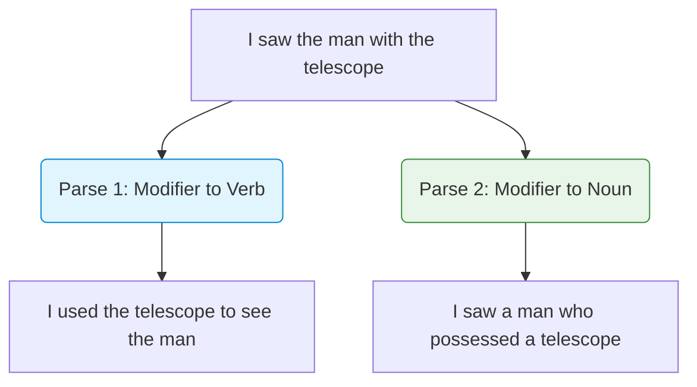

# Challenges in NLP

## 1. Why Natural Language is Difficult
Human language evolved for efficient communication between intelligent beings with shared world knowledge. It did not evolve for computers. Because humans share so much context, we compress our language, leaving out details the listener can infer. Computers lack this shared world knowledge.

---

## 2. The Central Challenge: Ambiguity
Ambiguity is the central challenge of NLP. It occurs when a single linguistic construct has multiple valid interpretations. 

### The 4 Levels of Ambiguity

#### 1. Lexical Ambiguity (Word Level)
When a single word has multiple meanings.
- **Example**: "I went to the **bank**."
- **Computer's Problem**: Does "bank" mean the financial institution or the edge of a river?

#### 2. Syntactic Ambiguity (Grammar Level)
When a sentence can be parsed into multiple grammatical structures.
- **Example**: "I saw the man with the telescope."

#### 3. Semantic Ambiguity (Meaning Level)
When the grammar is unambiguous, but the actual meaning of the sentence is unclear.
- **Example**: "The car hit the pole while it was moving."
- **Computer's Problem**: What was moving? The car or the pole?

#### 4. Pragmatic Ambiguity (Intent Level)
When the literal meaning of the sentence differs from the speaker's true intent.
- **Example**: "Can you pass the salt?"
- **Literal Meaning**: Are you physically capable of passing the salt?
- **Pragmatic Meaning**: Please pass the salt.

---

## 3. Context and Variability
- **Context Dependency**: The word "apple" in a tech blog means a company; in a recipe, it means a fruit. Context resolution requires tracking state across long documents.
- **Variability (Paraphrasing)**: "The movie was great", "I loved the film", "What a fantastic picture" all mean the exact same thing but share zero vocabulary. The computer must map mathematically distinct inputs to the same semantic vector.

---

## 4. Spoken vs Written Language
NLP pipelines often treat text as perfectly structured, but spoken language is inherently messy.

| Feature | Written Language | Spoken Language |
| :--- | :--- | :--- |
| **Boundaries** | Clear (punctuation, spaces) | Unclear (continuous acoustic stream) |
| **Grammar** | Edited, grammatical | Spontaneous, often ungrammatical |
| **Vocabulary** | Formal | Slang, contractions, regional dialects |
| **Fluency** | Static | Contains disfluencies |

### Filler Words and Disfluencies
Disfluencies are breaks, irregularities, or non-lexical vocables that occur in otherwise fluent speech.
- **Fillers**: "uh", "um", "like", "you know"
- **False starts**: "I was going to—let's go to the store."
- **Repetitions**: "I I I think so."

---

## 5. Exam Preparation

### How to Write This in an Exam

**5-Mark Question:** Identify and define the four types of linguistic ambiguity, providing one example for each.
> **Answer**: 
> 1. **Lexical**: Ambiguity at the word level (e.g., "bank" meaning river or finance).
> 2. **Syntactic**: Ambiguity in grammatical structure (e.g., "I saw the man with the telescope" - who has the telescope?).
> 3. **Semantic**: Ambiguity in meaning despite clear grammar (e.g., "The car hit the pole while it was moving" - what is "it"?).
> 4. **Pragmatic**: Ambiguity in speaker intent (e.g., "Do you have the time?" - literal yes/no vs request for the current time).

**3-Mark Question:** How do filler words complicate sentiment analysis on transcribed speech?
> **Answer**: Filler words (e.g., "like", "um") introduce noise into the token sequence. If not properly normalized, a word such as "like" (which usually strongly denotes positive sentiment) might artificially inflate the positive sentiment score of a sentence when used merely as a conversational filler (e.g., "It was, like, terrible.").

---

### Can You Explain This?
- [ ] I can define the four levels of ambiguity.
- [ ] I can draw a parse tree logic demonstrating syntactic ambiguity.
- [ ] I can explain why variability (paraphrasing) makes keyword-matching systems fail.
- [ ] I can list three differences between written and spoken language processing.
