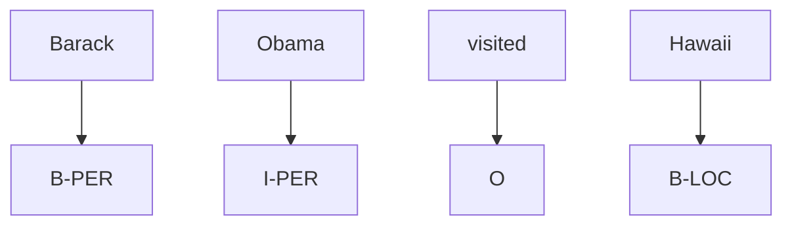

# Core NLP Tasks

## 1. What Are They?
NLP can be broken down into a taxonomy of core mathematical formulations. Almost every advanced application (like a chatbot) is built by combining these fundamental tasks.

## 2. Language Modeling
### Definition
Language modeling is the task of predicting the next word in a sequence given the previous words, or estimating the probability of an entire sentence.

### Formulation
Estimate the probability of a word $w_t$ given history:
$$ P(w_t \mid w_1, w_2, ..., w_{t-1}) $$

### Why it Matters
It is the core of modern Generative AI (like GPT). By repeatedly predicting the next word, a language model can generate infinite text.

---

## 3. Text Classification
### Definition
Assigning a discrete category (or label) to an entire document, paragraph, or sentence.

### Mechanism
Input: A sequence of tokens.
Output: A single label $y \in \{C_1, C_2, ... C_k\}$.

### Examples
- Spam detection (Spam vs Not Spam)
- Sentiment Analysis (Positive, Negative, Neutral)
- Topic categorization (Sports, Politics, Tech)

---

## 4. Sequence Labeling / Tagging
### Definition
Assigning a discrete category to *every single token* in a sequence.

### Mechanism
Input: Sequence of tokens $X = [x_1, x_2, ..., x_n]$
Output: Sequence of labels $Y = [y_1, y_2, ..., y_n]$

### Examples
- **Part-of-Speech (POS) Tagging**: [I/PRON, run/VERB, fast/ADV]
- **Named Entity Recognition (NER)**: [Apple/ORG, is/O, in/O, California/LOC]

---

## 5. Sequence Generation (Seq2Seq)
### Definition
Taking an input sequence and generating a completely new output sequence, often of a different length.

### Mechanism
Input: Sequence $X = [x_1, ..., x_n]$
Output: Sequence $Y = [y_1, ..., y_m]$

### Examples
- Machine Translation (English to French)
- Summarization (Long article to short paragraph)

## 6. Exam Preparation
### Must Memorize
Be able to formally distinguish between Text Classification (one label per text) and Sequence Labeling (one label per token).

### Likely Theory Question
**Question**: Is Part-of-Speech tagging a classification problem?
**Answer**: Yes, but specifically it is a *sequence labeling* (or token classification) problem, because a classification decision is made for every token in the sequence rather than a single decision for the entire sequence.
