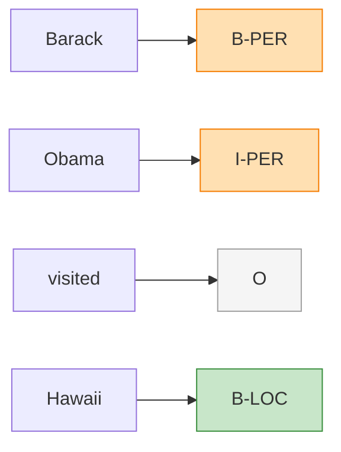

# Core NLP Tasks

## 1. What Are They?
NLP can be broken down into a taxonomy of core mathematical formulations. Almost every advanced application (like a chatbot) is built by combining these fundamental mathematical tasks.

---

## 2. Language Modeling
### Definition
Language modeling is the task of predicting the next word in a sequence given the previous words, or estimating the probability of an entire sentence.

### Mathematical Formulation
Estimate the probability of a word $w_t$ given its history:

!!! abstract "Language Model Probability"
    $$ P(w_t \mid w_1, w_2, \ldots, w_{t-1}) $$

### Why it Matters
It is the core of modern Generative AI (like GPT). By repeatedly predicting the next word and feeding it back into the model (autoregressive generation), a language model can generate infinite text.

---

## 3. Text Classification
### Definition
Assigning a discrete category (or label) to an entire document, paragraph, or sentence.

### Mechanism
- **Input**: A sequence of tokens.
- **Output**: A single label $y \in \{C_1, C_2, \ldots, C_k\}$.

### Examples
- **Spam detection**: Spam vs. Not Spam.
- **Sentiment Analysis**: Positive, Negative, Neutral.
- **Topic Categorization**: Sports, Politics, Tech.

---

## 4. Sequence Labeling (Token Classification)
### Definition
Assigning a discrete category to *every single token* in a sequence, rather than a single label for the whole document.

### Mechanism
- **Input**: Sequence of tokens $X = [x_1, x_2, \ldots, x_n]$.
- **Output**: Sequence of labels $Y = [y_1, y_2, \ldots, y_n]$.

### Visualizing Sequence Labeling

### Examples
- **Part-of-Speech (POS) Tagging**: [I/PRON, run/VERB, fast/ADV]
- **Named Entity Recognition (NER)**: Identifying people, organizations, and locations.

---

## 5. Sequence Generation (Seq2Seq)
### Definition
Taking an input sequence and generating a completely new output sequence, often of a completely different length.

### Mechanism
- **Input**: Sequence $X = [x_1, \ldots, x_n]$.
- **Output**: Sequence $Y = [y_1, \ldots, y_m]$.

### Examples
- **Machine Translation**: Translating English to French.
- **Abstractive Summarization**: Condensing a long article into a short paragraph.

---

## 6. Exam Preparation

### How to Write This in an Exam

**5-Mark Question**: Formally distinguish between Text Classification and Sequence Labeling, providing an example for each.
> **Answer**: 
> - **Text Classification** maps an entire sequence of tokens $X$ to a *single* discrete label $y$. Example: Sentiment Analysis, where an entire movie review is given a single label of "Positive" or "Negative".
> - **Sequence Labeling** (or token classification) maps a sequence of $n$ tokens to a corresponding sequence of $n$ labels. A classification decision is made at *every timestep*. Example: Part-of-Speech tagging, where every single word in a sentence is assigned a label (Noun, Verb, Adjective).

---

### Can You Explain This?
- [ ] I can write the conditional probability formula for language modeling.
- [ ] I can distinguish Text Classification from Sequence Labeling.
- [ ] I can define Seq2Seq generation.
