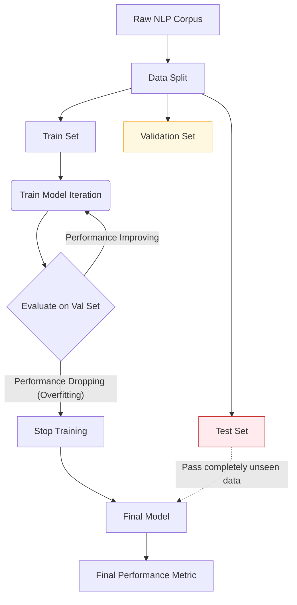

# Machine Learning Foundations in NLP

## 1. Why ML instead of Rules?
Modern NLP is entirely driven by Machine Learning. Early NLP systems attempted to hand-write thousands of grammar rules to parse sentences (Rule-Based NLP). This failed because human language has infinite exceptions.

Instead, we feed large amounts of text data to learning algorithms, allowing them to extract statistical patterns on their own.

---

## 2. The Data Split Pipeline
To build a robust NLP model, we must split our dataset to prevent **Overfitting** (where the model memorizes the training data but fails on real-world text).

### The 3 Splits
1. **Training Set (~80%)**: The data the model actually "sees" and uses to adjust its internal mathematical parameters (weights).
2. **Validation Set (~10%)**: Data used during the training process to tune hyperparameters (like learning rate) and to decide when to stop training (early stopping). The model is evaluated on this, but parameters are NOT updated from it.
3. **Testing Set (~10%)**: A completely unseen dataset used exactly **ONCE** at the very end to evaluate the final model's real-world performance.

### Visualizing the Training Loop

### Inference
**Inference** is the production phase. It is the process of passing new, real-world data (e.g., a live user typing into ChatGPT) through a fully trained model to get a prediction or generation. No learning/updating happens during inference.

---

## 3. Inductive Bias
### Formal Definition
An **inductive bias** is the set of mathematical assumptions a learning algorithm makes to predict outputs for inputs it has never encountered.

### Why Does It Exist?
Without bias, a model cannot generalize. If a model only ever sees the exact sentence "The cat sat on the mat" in training, how does it know what to do with "The dog sat on the rug"? It uses its inductive bias to assume that words in similar positions might behave similarly.

### Inductive Biases in NLP Models
Different architectures make completely different assumptions about how language works:

| Architecture | Its Inductive Bias |
| :--- | :--- |
| **N-grams** | The next word depends *only* on the previous $N-1$ words (Markov assumption). Long-range context is irrelevant. |
| **Recurrent Neural Networks (RNNs)** | Language is strictly sequential and must be processed left-to-right, one word at a time. |
| **Transformers / Attention** | Any word in a sentence can dynamically relate to any other word, regardless of physical distance. |

---

## 4. Exam Preparation

### How to Write This in an Exam

**3-Mark Question:** Explain the difference between the Validation Set and the Test Set in ML.
> **Answer**: The Validation set is used *during* the training phase to tune hyperparameters and determine when to stop training (preventing overfitting). The Test set is a strictly isolated hold-out dataset used exactly once at the end of the project to evaluate the final model's real-world generalization performance.

**5-Mark Question:** Define Inductive Bias and provide two examples of inductive biases used in NLP modeling.
> **Answer**: Inductive bias refers to the set of assumptions an algorithm makes to generalize to unseen data. Without it, a model would only be able to perfectly memorize its training set. 
> Example 1: N-gram models hold a Markov assumption inductive bias, assuming the probability of a word depends solely on the immediate previous $N-1$ words.
> Example 2: Recurrent Neural Networks hold a sequential inductive bias, assuming that language must be processed strictly left-to-right, with hidden states passed consecutively.

> [!CAUTION]
> **Common Mistake**
> Never say "We use the validation set to calculate the final accuracy of the model." The validation set influences the training cycle (e.g., early stopping). The test set alone provides the final, unbiased metric.

---

### Can You Explain This?
- [ ] I can define Training, Validation, and Testing sets.
- [ ] I know why evaluating a model on its Training set is useless.
- [ ] I can define Inference.
- [ ] I can explain what Inductive Bias is and why it's necessary for generalization.
- [ ] I can state the inductive bias of an N-gram model versus an RNN.
