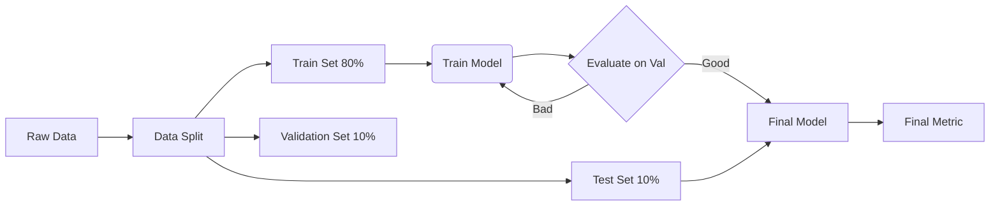

# Machine Learning Foundations in NLP

## 1. What Is It?
Modern NLP is entirely driven by Machine Learning. Instead of hand-writing thousands of grammar rules, we feed large amounts of data to learning algorithms, allowing them to extract patterns statistically.

## 2. Training, Validation, Testing and Inference
To build a robust NLP model, we must split our data.

### The Splits
1. **Training Set**: The data the model actually "sees" and uses to adjust its internal parameters (weights).
2. **Validation Set**: Data used during training to tune hyperparameters (like learning rate) and to decide when to stop training (early stopping). The model is evaluated on this, but parameters are not updated from it.
3. **Testing Set**: A completely unseen dataset used exactly ONCE at the very end to evaluate the final model's real-world performance.

### Inference
**Inference** is the production phase. It is the process of passing new, real-world data through a fully trained model to get a prediction or generation. No learning happens during inference.

## 3. Inductive Bias
### Formal Definition
An **inductive bias** is the set of assumptions a learning algorithm makes to predict outputs for inputs it has never encountered.

### Why Does It Exist?
Without bias, a model cannot generalize. If a model sees "The cat sat on the mat" in training, how does it know what to do with "The dog sat on the rug"? It uses its inductive bias.

### Examples in NLP
- **N-grams**: The bias is that the next word depends *only* on the previous N-1 words (Markov assumption).
- **Recurrent Neural Networks (RNNs)**: The bias is that language is strictly sequential and processed left-to-right.
- **Transformers / Attention**: The bias is that any word in a sentence can dynamically relate to any other word, regardless of distance.

## 4. Exam Preparation
### Must Know
- The precise difference between Validation and Testing sets.
- The definition of Inductive Bias and how it applies to sequence modeling.

### Common Mistake
> [!CAUTION]
> Students often claim the validation set is used to evaluate the model's final performance. This is **incorrect**. The validation set is part of the training cycle used for hyperparameter tuning. The *test set* is used for final evaluation.
