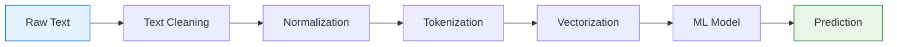

# NLP Applications & Pipeline Overview

## 1. Major NLP Applications
Modern NLP powers a vast array of applications. Each application is typically built by chaining together the core mathematical tasks (like sequence labeling and sequence generation).

| Application | Goal | Underlying NLP Task | Example |
| :--- | :--- | :--- | :--- |
| **Machine Translation** | Convert text across languages | Sequence-to-Sequence | Google Translate |
| **Speech Recognition** | Convert acoustic signals to text | Sequence-to-Sequence | Siri, Whisper |
| **Summarization (Abstractive)** | Condense a long document | Sequence-to-Sequence | ChatGPT summaries |
| **Summarization (Extractive)** | Extract key existing sentences | Sequence Labeling / Scoring | Traditional summarizers |
| **Sentiment Analysis** | Determine emotional tone | Text Classification | Brand reputation tracking |
| **Speaker Identification** | Determine *who* is speaking | Biometric Classification | Voice authentication |

---

## 2. The NLP Pipeline Overview
Before a raw text string can be fed into a machine learning model, it must pass through a strict preprocessing pipeline.

### Visualizing the Pipeline

### The 5 Stages
1. **Text Cleaning**: Removing HTML tags, fixing encoding errors, stripping out formatting.
2. **Normalization**: Lowercasing, removing punctuation, reducing words to their base form (stemming/lemmatization).
3. **Tokenization**: Breaking the text into discrete units (words, subwords, or characters).
4. **Vectorization / Feature Engineering**: Converting string tokens into mathematical vectors (e.g., TF-IDF, Word Embeddings) because ML models only understand numbers.
5. **Modeling**: Passing the vectors into a classifier or generator to make a prediction.

---

## 3. Before and After: The Pipeline in Action

Consider building an NLP model to classify movie reviews.
- **RAW INPUT**: `"
I LOVED the acting!!! It was the best.
"`
- **CLEANING**: `"I LOVED the acting!!! It was the best."` *(HTML removed)*
- **NORMALIZATION**: `"i love the act it be the best"` *(Lowercased, punctuation removed, lemmatized)*
- **TOKENIZATION**: `["i", "love", "the", "act", "it", "be", "the", "best"]`
- **VECTORIZATION**: `[0.0, 1.2, 0.5, 0.8, 0.1, 0.1, 0.5, 1.4]` *(e.g., TF-IDF weights)*
- **MODEL OUTPUT**: `[Positive]`

---

## 4. Exam Preparation

### How to Write This in an Exam

**10-Mark Question**: Design the end-to-end NLP pipeline required to build a system that detects whether a user's movie review is positive or negative. Provide examples of the data at each stage.
> **Answer**: 
> 1. **Data Collection**: Gather labeled movie reviews (Text, Rating).
> 2. **Text Cleaning**: Remove noise from the raw text, such as HTML tags (e.g., converting `<b>Bad movie</b>` to `Bad movie`).
> 3. **Normalization**: Standardize the text by lowercasing and removing punctuation (e.g., `bad movie`). Apply Lemmatization to reduce words to their roots.
> 4. **Tokenization**: Split the normalized string into discrete tokens (e.g., `["bad", "movie"]`).
> 5. **Vectorization (Feature Extraction)**: Convert the string tokens into numerical vectors that a machine learning model can process (e.g., using TF-IDF or Word2Vec).
> 6. **Modeling**: Train a Text Classifier (such as Naive Bayes or a Neural Network) to map the numerical vectors to a discrete output space `{Positive, Negative}`.
> 7. **Evaluation**: Test the final model on an unseen holdout set using metrics like Accuracy and F1-score to ensure it generalizes well.

---

### Can You Explain This?
- [ ] I can list 5 major applications of NLP.
- [ ] I can distinguish between Extractive and Abstractive summarization.
- [ ] I can draw the 5 steps of the NLP preprocessing pipeline from memory.
- [ ] I can trace a raw string through the pipeline and show how it transforms.
