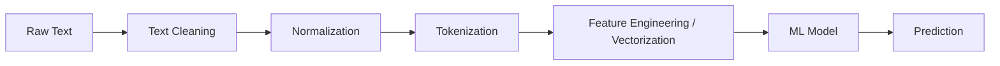

# NLP Applications & Pipeline Overview

## 1. Major NLP Applications
Modern NLP powers a vast array of applications. Each application is typically built by chaining together core tasks (like sequence labeling and sequence generation).

### Machine Translation
- **Goal**: Convert text from a source language to a target language while preserving semantic meaning.
- **Underlying Task**: Sequence-to-Sequence Generation (Seq2Seq).
- **Example**: Google Translate, DeepL.

### Speech Recognition (ASR)
- **Goal**: Convert spoken acoustic signals into written text.
- **Underlying Task**: Sequence-to-Sequence (Audio Frames -> Tokens).
- **Example**: Siri, Alexa, Whisper.

### Text-to-Speech (TTS)
- **Goal**: Convert written text into natural-sounding human speech.
- **Example**: Audiobooks, navigation systems.

### Summarization
- **Goal**: Condense a long document into a shorter version.
- **Extractive**: Selects the most important existing sentences and stitches them together.
- **Abstractive**: Generates entirely new sentences that capture the core meaning (Seq2Seq).

### Speaker Identification
- **Goal**: Determine *who* is speaking, rather than *what* they are saying. (A biometric classification task).

### Sentiment Analysis
- **Goal**: Determine the emotional tone behind a series of words.
- **Underlying Task**: Text Classification.
- **Example**: Analyzing Twitter data for brand reputation.

### Chatbots and Conversational Agents
- **Goal**: Maintain a multi-turn dialogue with a user to achieve a goal (task-oriented) or chit-chat (open-domain).
- **Mechanism**: Pipeline of intent classification, slot filling (NER), dialogue state tracking, and natural language generation (NLG).

### Code Assistants
- **Goal**: Auto-complete code or generate code from natural language prompts.
- **Example**: GitHub Copilot. (Fundamentally just a Language Model trained on code repositories).

---

## 2. The NLP Pipeline Overview
Before a raw text string can be fed into a machine learning model, it must pass through a strict preprocessing pipeline.

1. **Text Cleaning**: Removing HTML tags, fixing encoding errors.
2. **Normalization**: Lowercasing, removing punctuation, stemming/lemmatization.
3. **Tokenization**: Breaking the text into discrete units (words, subwords, or characters).
4. **Feature Engineering**: Converting string tokens into mathematical vectors (e.g., TF-IDF, Word Embeddings) because ML models only understand numbers.
5. **Modeling**: Passing the vectors into a classifier or generator.

## 3. Exam Preparation
### Must Know
- The difference between Extractive and Abstractive summarization.
- The standard order of operations in an NLP pipeline.

### Likely Practical Question
**Question**: Design the NLP pipeline required to build a system that detects whether a movie review is positive or negative.
**Answer**: 
1. **Data Collection**: Gather labeled movie reviews (Text, Rating).
2. **Cleaning/Normalization**: Lowercase all text, remove special characters and HTML tags.
3. **Tokenization**: Split the review into subword/word tokens.
4. **Vectorization**: Convert tokens to TF-IDF vectors or word embeddings.
5. **Modeling**: Train a Text Classifier (e.g., Naive Bayes or Logistic Regression) to map vectors to Positive/Negative labels.
6. **Evaluation**: Test on an unseen holdout set using Accuracy and F1-score.
