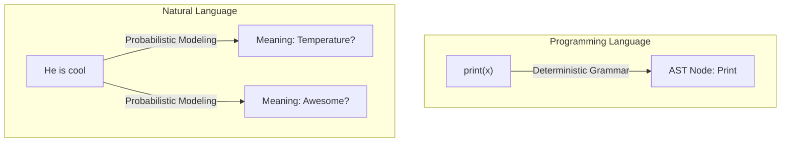
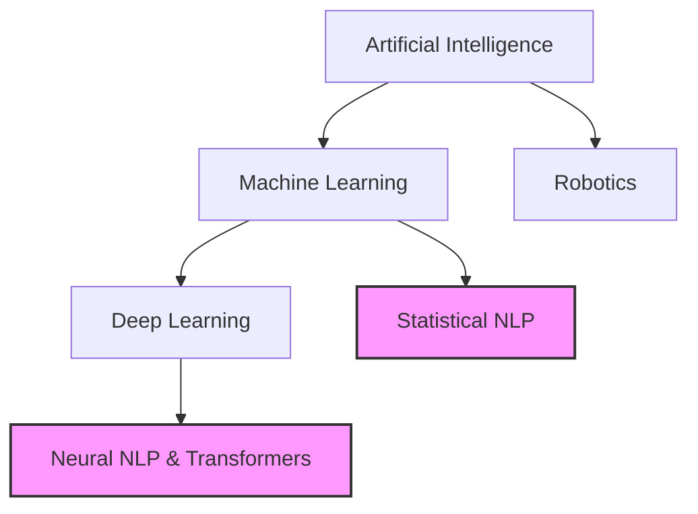

# What is Natural Language Processing?

## 1. What Is It?
Natural Language Processing (NLP) is the intersection of artificial intelligence, computer science, and linguistics. Its goal is simple to state but incredibly difficult to execute: teach a computer to understand human language.

We aren't just parsing strings here. We want systems that actually grasp the contextual nuances of a document. If we succeed, the machine can extract real insights, summarize long reports, or even write completely new text.

## 2. Intuition
Think about how you read a book. You don't just stare at ink blobs. You instantly recognize letters, piece together syntax, resolve pronouns ("he" means the killer), and ultimately extract meaning. 

For a computer, that book is just a raw sequence of Unicode characters. It feels nothing. It understands nothing. NLP provides the specific engineering techniques required to elevate those raw characters into structured, actionable meaning.

---

## 3. Natural Language vs. Programming Language
A foundational concept in NLP is understanding why parsing human text is so much harder than compiling computer code.

| Feature | Programming Languages (e.g., Python) | Natural Languages (e.g., English) |
| :--- | :--- | :--- |
| **Vocabulary** | Closed (limited to defined keywords) | Open (new words invented constantly like "doomscrolling") |
| **Syntax** | Rigid and mathematically strict | Flexible and evolving |
| **Ambiguity** | Unambiguous (one meaning per statement) | Highly ambiguous ("I saw a man with a telescope") |
| **Context** | Independent (meaning is explicit) | Dependent (meaning relies on tone and situation) |

### Visualizing the Parsing Difference

---

## 4. Where NLP Fits in the AI Ecosystem
People often use "AI" and "NLP" interchangeably. They shouldn't. NLP is a highly specific engineering domain sitting under the broader AI umbrella.

---

## 5. NLP vs Computational Linguistics
These two fields are siblings, but they have fundamentally different end goals:

- **Computational Linguistics (CL)**: The science side. It focuses on understanding the properties of human language from a computational perspective. **(Goal: Discovery)**
- **Natural Language Processing (NLP)**: The engineering side. It focuses on building practical tools to solve real problems. **(Goal: Application)**

*Example*: A computational linguist might spend three years building a formal mathematical proof about the syntactic structure of Hindi. An NLP engineer will spend three weeks building a sentiment classifier to rank Hindi movie reviews. Same language, totally different jobs.

---

## 6. Exam Preparation

### How to Write This in an Exam

**2-Mark Question:** Define Natural Language Processing.
> **Answer**: Natural Language Processing (NLP) is an interdisciplinary field of AI and linguistics focused on programming computers to process, analyze, and understand large volumes of human language data to perform tasks like translation or sentiment analysis.

**5-Mark Question:** Contrast Natural Languages with Programming Languages in the context of computer processing.
> **Answer**: 
> 1. **Ambiguity**: Programming languages are strictly unambiguous, meaning every valid statement compiles to exactly one instruction. Natural languages are inherently ambiguous (e.g., lexical ambiguity where "bank" means a river or a financial institution).
> 2. **Vocabulary**: Code uses a closed, finite set of keywords. Human language uses an open, constantly evolving vocabulary (e.g., slang).
> 3. **Rules**: Code relies on strict context-free grammars. Human language rules are flexible and frequently broken in colloquial speech.

> [!WARNING]
> **Common Mistake**
> Do not confuse basic string manipulation (like `text.split()` or Regex) with true NLP. NLP implies statistical, semantic, or deep syntactic modeling to extract *meaning*, not just pattern matching.

---

### Can You Explain This?
- [ ] I can define NLP.
- [ ] I can explain the intuition behind why NLP is necessary.
- [ ] I can list three differences between Natural and Programming languages.
- [ ] I can differentiate NLP (engineering) from Computational Linguistics (science).
