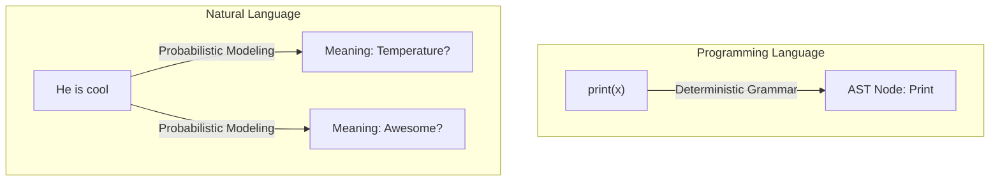
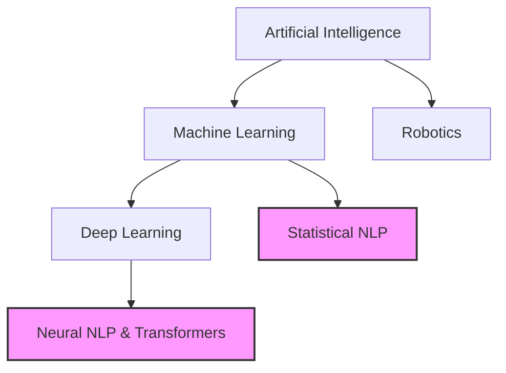

# What is Natural Language Processing?

## 1. What Is It?
Natural Language Processing (NLP) is an interdisciplinary subfield of artificial intelligence, computer science, and linguistics. It focuses on the interaction between computers and human language, specifically how to program computers to process and analyze large amounts of natural language data.

The ultimate goal of NLP is to build systems capable of "understanding" the contents of documents, including the contextual nuances of the language within them, so they can accurately extract information and insights, or even generate new text.

## 2. Intuition
Think of how you read a book. You don't just see shapes on a page; you recognize letters, form words, parse syntax, resolve pronouns, and ultimately extract meaning and emotion. For a computer, text is just a sequence of ASCII or Unicode characters. NLP is the set of techniques that elevates those characters into structured, actionable meaning.

---

## 3. Natural Language vs. Programming Language
A foundational concept in NLP is understanding why parsing human text is so much harder than compiling computer code.

| Feature | Programming Languages (e.g., Python) | Natural Languages (e.g., English) |
| :--- | :--- | :--- |
| **Vocabulary** | Closed (limited to defined keywords) | Open (new words invented constantly like "doomscrolling") |
| **Syntax** | Rigid and mathematically strict | Flexible and evolving |
| **Ambiguity** | Unambiguous (one meaning per statement) | Highly ambiguous ("I saw a man with a telescope") |
| **Context** | Independent (meaning is explicit) | Dependent (meaning relies on tone and situation) |

### Visualizing the Parsing Difference

---

## 4. Where NLP Fits in the AI Ecosystem
NLP is not synonymous with AI; it is a specific domain within it.

---

## 5. NLP vs Computational Linguistics
These two fields are siblings but have different goals:

- **Computational Linguistics (CL)**: Focuses on understanding the properties of human language from a computational perspective. **(Goal: Science / Discovery)**
- **Natural Language Processing (NLP)**: Focuses on building tools to solve practical problems. **(Goal: Engineering / Application)**

*Example*: A computational linguist might build formal mathematical proofs about the syntactic structure of Hindi. An NLP engineer will build a sentiment classifier for Hindi movie reviews.

---

## 6. Exam Preparation

### How to Write This in an Exam

**2-Mark Question:** Define Natural Language Processing.
> **Answer**: Natural Language Processing (NLP) is an interdisciplinary field of AI and linguistics focused on programming computers to process, analyze, and understand large volumes of human language data to perform tasks like translation or sentiment analysis.

**5-Mark Question:** Contrast Natural Languages with Programming Languages in the context of computer processing.
> **Answer**: 
> 1. **Ambiguity**: Programming languages are strictly unambiguous, meaning every valid statement compiles to exactly one instruction. Natural languages are inherently ambiguous (e.g., lexical ambiguity where "bank" means a river or a financial institution).
> 2. **Vocabulary**: Code uses a closed, finite set of keywords. Human language uses an open, constantly evolving vocabulary (e.g., slang).
> 3. **Rules**: Code relies on strict context-free grammars. Human language rules are flexible and frequently broken in colloquial speech.

> [!WARNING]
> **Common Mistake**
> Do not confuse basic string manipulation (like `text.split()` or Regex) with true NLP. NLP implies statistical, semantic, or deep syntactic modeling to extract *meaning*, not just pattern matching.

---

### Can You Explain This?
- [ ] I can define NLP.
- [ ] I can explain the intuition behind why NLP is necessary.
- [ ] I can list three differences between Natural and Programming languages.
- [ ] I can differentiate NLP (engineering) from Computational Linguistics (science).
