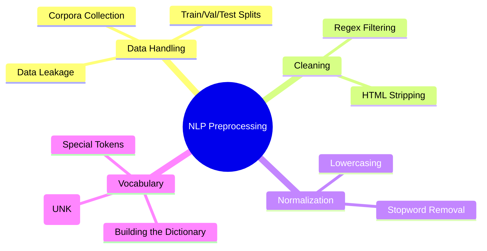

# 02. NLP Pipeline & Preprocessing

## 1. Topic Overview
This module covers the critical first steps of any NLP project: gathering text data, ensuring the data splits are scientifically sound to avoid data leakage, and applying text cleaning and normalization to reduce noise. 

## 2. Learning Path
1. [Data Collection and Splits](data-collection-and-splits.md)
2. [Text Cleaning and Normalization](text-cleaning-and-normalization.md)
3. [Vocabulary and Feature Engineering](vocabulary-and-features.md)

## 3. Real-World Applications
- **Scraping Reddit/Twitter**: Requires aggressive cleaning (removing URLs, `@handles`, and emojis) before training a sentiment classifier.
- **Medical Records**: Requires anonymization (removing PII like names and dates) and handling specialized vocabulary.
- **Search Engines**: Standardizing user queries (e.g., matching "RUNNING" with "run") to retrieve accurate documents.

## 4. Difficulty & Importance
- **Mathematical Difficulty**: ★☆☆☆☆ (Very Low)
- **Implementation Difficulty**: ★★☆☆☆ (Low - Basic Python string manipulation and Regular Expressions)
- **Exam Importance**: **Medium**. Expect theoretical questions on Data Leakage and practical questions asking you to write a Python function to clean a specific type of text.

## 5. Prerequisites
- [01. NLP Fundamentals](../01-nlp-fundamentals/README.md)

## 6. External Resources
- 📘 **Textbook**: *Speech and Language Processing* (Jurafsky & Martin), Chapter 2.
- 🎓 **Tutorial**: [Regex for NLP in Python](https://docs.python.org/3/howto/regex.html)

---

### Can You Explain This?
- [ ] I can define Data Leakage and explain how building a vocabulary over the whole dataset causes it.
- [ ] I can write a Python function to strip HTML tags from a string.
- [ ] I understand why lowercasing text is sometimes harmful to NLP performance.
- [ ] I can explain the purpose of the `<UNK>` token in a vocabulary.
