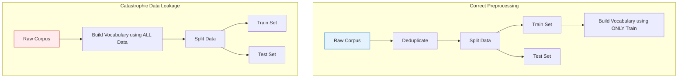

# Data Collection and Splits

## 1. What Is It?
Before any NLP model can be trained, we need data. Data collection involves gathering corpora (large bodies of text), while data splitting refers to how we divide that data into subsets to train and evaluate the model without bias.

---

## 2. The Train / Validation / Test Split
As covered in the fundamentals module, models require three strictly isolated datasets.

| Split | Percentage | Purpose | Can the model update parameters from it? |
| :--- | :--- | :--- | :--- |
| **Train** | ~80% | Learning mathematical relationships (weights). | YES |
| **Validation** | ~10% | Tuning hyperparameters and early stopping. | NO |
| **Test** | ~10% | Final, unbiased evaluation of generalization. | NO |

---

## 3. The Danger of Data Leakage

### Formal Definition
Data leakage occurs when information from outside the training dataset (i.e., information from the test set or the real world) is inadvertently used to create the model. This leads to overly optimistic performance during training that will catastrophically fail in production.

### How Data Leakage Happens in NLP

1. **Target Leakage**: The label you are trying to predict is accidentally included in the input text. 
   - *Example*: You are trying to predict if a movie review is positive. The raw text says, "I loved it. Rating: 5/5". The model just learns to look for the "5/5" string rather than learning sentiment.
2. **Train-Test Contamination**: The test data is accidentally included in the training data. 
   - *Example*: You scrape Twitter for data. You split the data into Train and Test. *Then* you remove duplicate tweets. If a tweet was retweeted 10 times, 8 copies might end up in Train and 2 in Test. The model memorizes the tweet during training and gets a perfect score on the test set. (Deduplication must happen *before* splitting).
3. **Preprocessing Leakage**: Applying vocabulary construction or TF-IDF fitting on the *entire* dataset before splitting it. 

### Visualizing Preprocessing Leakage

---

## 4. Exam Preparation

### How to Write This in an Exam

**5-Mark Question**: An NLP engineer builds a vocabulary of the top 10,000 words across all available data, then splits the data into train and test sets. Explain why this is a methodological error.
> **Answer**: This causes preprocessing data leakage. By building the vocabulary over the entire dataset, the vocabulary will contain words that exclusively appear in the test set. The model will learn a dedicated representation for these test-set words. During evaluation, the model will seemingly handle these words correctly, yielding artificially high accuracy. However, in a real-world scenario, the model would treat those words as unknown (`<UNK>`) tokens and likely fail. The vocabulary must be built strictly on the training set to accurately simulate real-world conditions.

---

### Can You Explain This?
- [ ] I can define the ratios and purposes of the Train, Validation, and Test sets.
- [ ] I can define Data Leakage.
- [ ] I can explain why removing duplicates *after* splitting the data causes train/test contamination.
- [ ] I understand why TF-IDF vectorizers must only be `fit` on the training data, and only `transformed` on the test data.
