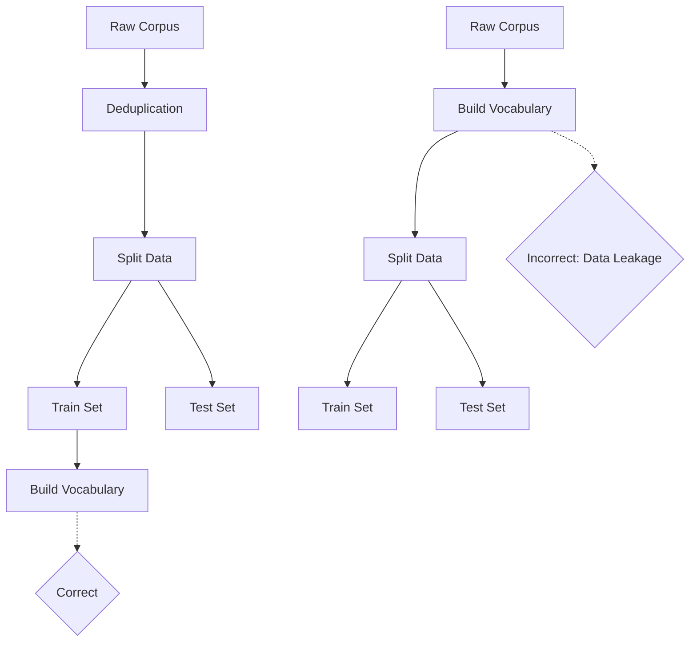

# Data Collection and Splits

## 1. What Is It?
Before any NLP model can be trained, we need data. Data collection involves gathering corpora (large bodies of text), while data splitting refers to how we divide that data into subsets to train and evaluate the model without bias.

## 2. Train/Test/Validation Split
As covered in Module 1, models require three distinct datasets:
- **Training Set (typically 70-80%)**: Used to adjust the model's weights.
- **Validation Set (typically 10-15%)**: Used to tune hyperparameters (like learning rate) and prevent overtraining (early stopping).
- **Test Set (typically 10-15%)**: A purely unseen dataset used exclusively for the final evaluation.

## 3. Data Leakage
### Formal Definition
Data leakage occurs when information from outside the training dataset is used to create the model. This leads to overly optimistic performance during training that will fail in production.

### How it happens in NLP
1. **Target Leakage**: The label is inadvertently included in the input text. (e.g., trying to predict if a review is positive, and the text includes "Rating: 5/5").
2. **Train-Test Contamination**: The test data is accidentally included in the training data. This is common when doing text deduplication *after* splitting the data instead of *before*.
3. **Preprocessing Leakage**: Applying vocabulary construction or TF-IDF fitting on the *entire* dataset before splitting it. The vocabulary must only be learned from the training set.

### Visualization

## 4. Model Training and Evaluation
- **Training**: The iterative process of minimizing a loss function (like Cross Entropy) over the training set.
- **Evaluation**: Calculating metrics like Accuracy, Precision, Recall, or Perplexity on the validation/test sets to measure generalization.

## 5. Exam Preparation
### Must Know
- The definition and causes of data leakage.
- Why TF-IDF vectorizers must only be `fit` on the training data and `transformed` on the test data.

### Likely Theory Question
**Question**: An NLP engineer builds a vocabulary of the top 10,000 words across all available data, then splits the data into train and test sets. Why is this a mistake?
**Answer**: This causes preprocessing data leakage. The vocabulary will contain words that only appear in the test set. During evaluation, the model will seemingly handle these words correctly, but in a real-world scenario, the model would treat them as unknown `<UNK>` tokens. The vocabulary must be built strictly on the training set.
