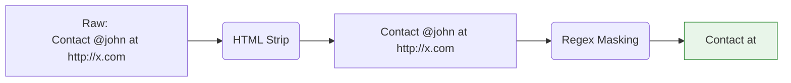

# Text Cleaning and Normalization

## 1. What Is It?
Raw text is noisy. It contains HTML tags, inconsistent capitalization, emojis, URLs, and bizarre punctuation. 
- **Text Cleaning** is the process of removing unwanted noise from the data.
- **Normalization** is the process of converting text into a standard, uniform format so that computationally identical concepts look identical to the computer.

---

## 2. Text Cleaning Pipeline
Before looking at words, we clean the characters.

| Cleaning Step | Why we do it | Common Implementation |
| :--- | :--- | :--- |
| **HTML Stripping** | Web scraped data contains `<p>`, `<br>`, `<a>`. Models don't need this structure for text tasks. | BeautifulSoup or Regex (`<[^>]+>`). |
| **Masking PII** | To protect user privacy in medical or financial NLP. | Replacing phone numbers with `<PHONE>`. |
| **Masking URLs/Handles** | A model doesn't need to learn every unique URL in the world. | Regex replacing `http\S+` with `<URL>`. |

### Visualizing the Cleaning Step


---

## 3. Normalization Techniques
Normalization reduces the dimensionality of the vocabulary. If you don't normalize, the words `apple`, `Apple`, and `APPLE` will each get their own separate mathematical weight in the model, wasting memory and data.

### Lowercasing / Uppercasing
Converting everything to lowercase is standard practice.
> [!WARNING]
> **When Lowercasing Fails**
> Lowercasing destroys critical semantic information for Named Entity Recognition (NER). It makes it impossible for the model to distinguish between "Apple" (the trillion-dollar company) and "apple" (the fruit), or "US" (United States) and "us" (pronoun).

### Punctuation Normalization
- **Stripping**: Removing punctuation completely: `Hello, world!` $\rightarrow$ `Hello world`
- **Standardization**: Converting different typographic quotes (`'`, `‘`, `’`) into a single standard straight quote `'`.

### Unicode Normalization
Text can be visually identical on your screen but computationally completely different. 
- "é" can be represented as a single character (`U+00E9`) or as an "e" followed by an invisible combining accent mark (`U+0065` + `U+0301`).
- Unicode normalization (like NFKC or NFC) ensures these are collapsed into identical underlying bytes.

---

## 4. Scratch Implementation

```python
import re
import unicodedata

def clean_and_normalize(text: str) -> str:
    # 1. Unicode Normalization (NFC)
    text = unicodedata.normalize('NFC', text)
    
    # 2. Lowercase
    text = text.lower()
    
    # 3. Replace URLs and Emails
    text = re.sub(r'http\S+', '<URL>', text)
    text = re.sub(r'\S+@\S+', '<EMAIL>', text)
    
    # 4. Remove punctuation (excluding the < > for placeholders)
    text = re.sub(r'[^\w\s<>]', '', text)
    
    # 5. Whitespace normalization (replace multiple spaces/tabs with one space)
    text = re.sub(r'\s+', ' ', text).strip()
    
    return text
```

### Try It Yourself

??? question "Trace the code on this input"
    **Input:** `"Check out my new website https://example.com!! Email me at test@test.com.      It's GREAT."`
    
    **Output:**
    `"check out my new website <URL> email me at <EMAIL> its great"`
    
    *Notice how the exclamation points, periods, and the apostrophe in "It's" were removed by Step 4, and the massive gap of spaces was collapsed by Step 5.*

---

## 5. Exam Preparation

### How to Write This in an Exam

**2-Mark Question**: Write a regular expression in Python to normalize all whitespace (including tabs and newlines) into a single space.
> **Answer**: `re.sub(r'\s+', ' ', text)`

**3-Mark Question**: Provide one scenario where lowercasing all text during normalization would degrade model performance.
> **Answer**: Lowercasing degrades performance in Named Entity Recognition (NER). Capitalization is one of the strongest orthographic features indicating a proper noun. By lowercasing, the model loses the ability to easily distinguish between common nouns and entities (e.g., distinguishing "Will" the person from "will" the auxiliary verb).

---

### Can You Explain This?
- [ ] I can distinguish between Text Cleaning and Normalization.
- [ ] I can write the regex to collapse whitespace.
- [ ] I can explain why Unicode Normalization is required.
- [ ] I can list the potential dangers of lowercasing text.
