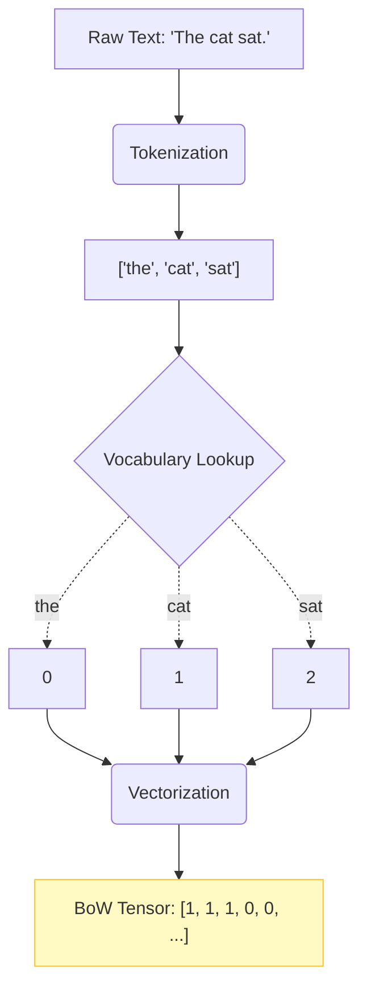

# Vocabulary Construction and Feature Engineering

## 1. Vocabulary Construction
After text is normalized and tokenized (covered deeply in Module 3), we are left with a list of string tokens. Machine learning models cannot process strings; they process tensors (matrices of numbers). The first step to converting text to numbers is building a vocabulary.

### Mechanism
A **vocabulary** (often denoted as $V$) is a deterministic dictionary mapping from a known string token to a unique integer index.

```json
{
  "the": 0,
  "cat": 1,
  "sat": 2,
  "<UNK>": 3
}
```

### Out of Vocabulary (OOV)
Inevitably, the model will encounter words in the test set or the real world that were not present in the training set. If the model sees the word "dog" but "dog" is not in the vocabulary mapping, it crashes. 

We handle this using an **Unknown** token, often written as `<UNK>`. Any word that does not exist in the vocabulary is forcefully mapped to the integer index of `<UNK>`.

---

## 2. Feature Engineering
Once we have a vocabulary index, we convert the documents into numerical features.

### 1. One-Hot Encoding
Each word is a vector of size $|V|$, with a `1` at its specific index and `0` everywhere else.
- *Problem*: Extremely sparse (mostly zeros). Requires massive memory. Cannot capture semantic meaning (the dot product of any two distinct one-hot vectors is always 0).

### 2. Bag of Words (BoW) / Count Vectorization
A document is represented as the sum of its one-hot encoded words. It counts how many times each vocabulary word appears in the document.
- *Problem*: Ignores word order completely. "The cat chased the dog" and "The dog chased the cat" have the exact same BoW representation.

### 3. TF-IDF (Term Frequency-Inverse Document Frequency)
Weights words based on how frequently they appear in the document versus how rare they are across the whole corpus. (Covered extensively in Module 12).

### 4. Word Embeddings
Dense vectors (like Word2Vec or GloVe) where vectors that are close in space represent words with similar semantic meanings.

---

## 3. Visualizing Text to Tensor



---

## 4. Exam Preparation

### How to Write This in an Exam

**5-Mark Question**: Define an Out-of-Vocabulary (OOV) word and explain the standard mechanism for handling it during the preprocessing pipeline.
> **Answer**: An Out-of-Vocabulary (OOV) word is a token encountered during the testing or inference phase that was not present in the training dataset used to construct the model's vocabulary. Because the model expects a known integer index for every token, an OOV word causes a lookup failure. The standard mechanism to handle this is the `<UNK>` (Unknown) token. During vocabulary construction, an index is reserved for `<UNK>`. During inference, any unrecognized string is mapped to the `<UNK>` index, allowing the model to process the sequence, albeit with a loss of specific lexical information.

> [!CAUTION]
> **Common Mistake**
> Building the vocabulary on the entire dataset (Train + Test) is a form of Data Leakage. The vocabulary must only contain words found in the Training Set.

---

### Can You Explain This?
- [ ] I can explain what a vocabulary mapping is.
- [ ] I can explain why the `<UNK>` token is mathematically necessary to prevent inference crashes.
- [ ] I can list two problems with One-Hot Encoding.
- [ ] I understand that Bag-of-Words loses all information regarding sequence order.
