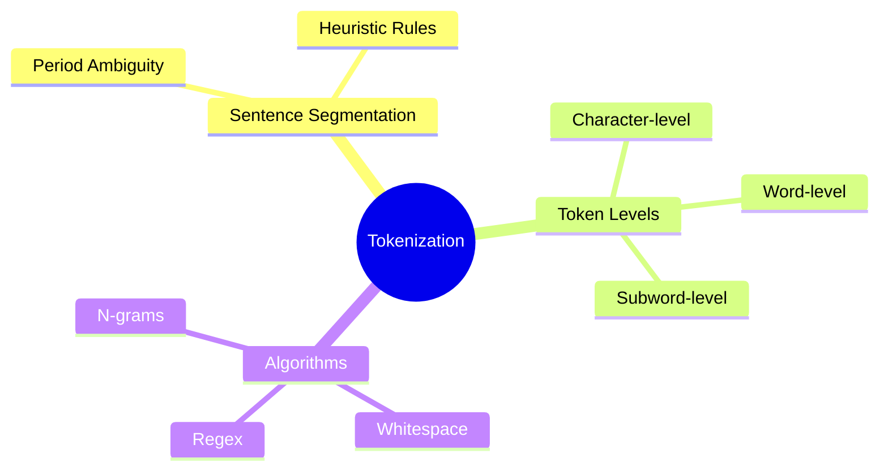

# 03. Tokenization

## 1. Topic Overview
This module covers how we slice a continuous string of text into the fundamental atomic units (tokens) that machine learning models process.

## 2. Learning Path
1. [Tokenization Fundamentals](tokenization-fundamentals.md)
2. [Sentence Segmentation](sentence-segmentation.md)
3. [Tokenization Algorithms & Scratch Implementations](tokenization-algorithms.md)

## 3. Real-World Applications
- **Handling Typos**: Subword tokenization (like BPE, covered later) allows models to handle typos by breaking unknown words into known subwords.
- **Search Engines**: N-gram tokenization allows search engines to match exact multi-word phrases (like "machine learning") instead of just isolated words.

## 4. Difficulty & Importance
- **Mathematical Difficulty**: ★☆☆☆☆ (Very Low)
- **Implementation Difficulty**: ★★★☆☆ (Medium - Requires algorithmic thinking for sliding windows and regex)
- **Exam Importance**: **High**. Implementing an n-gram extractor from scratch is a highly common interview and exam question.

## 5. Prerequisites
- [02. NLP Pipeline & Preprocessing](../02-nlp-pipeline-and-preprocessing/README.md)
- Basic Python string manipulation.

## 6. External Resources
- 📘 **Textbook**: *Speech and Language Processing* (Jurafsky & Martin), Chapter 2.4.

---

### Can You Explain This?
- [ ] I can explain the tradeoffs between word-level and character-level tokenization.
- [ ] I can write a Python function to extract n-grams from a list of tokens.
- [ ] I can calculate exactly how many n-grams will be produced by a sequence of length $N$.
