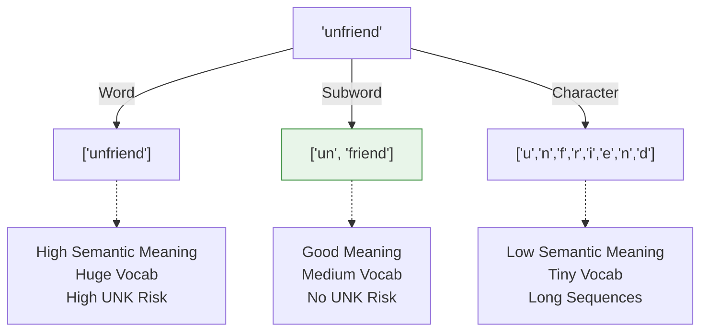

# Tokenization Fundamentals

## 1. What Is It?
Tokenization is the process of breaking down a continuous stream of text into smaller, discrete units called **tokens**. These tokens act as the fundamental atomic units that an NLP model processes.

## 2. Why Does It Exist?
Machine learning models (like Neural Networks) cannot read continuous text. They require distinct inputs that can be mapped to a vocabulary index and converted into mathematical vectors (tensors). Tokenization defines exactly what those distinct inputs are.

---

## 3. Levels of Tokenization

There are three primary philosophies on how to tokenize text, each with mathematical trade-offs between sequence length, vocabulary size, and semantic meaning.

### Character-Level Tokenization
Treating every single character (including spaces) as a token.
- **Input**: `"NLP"`
- **Tokens**: `["N", "L", "P"]`
- **Pros**: Tiny vocabulary size (e.g., ~100 in English). No Unknown (`<UNK>`) tokens because any word can be spelled from characters.
- **Cons**: Characters themselves have almost no semantic meaning. The sequence length becomes huge (a 10-word sentence might be 60 tokens), making it computationally expensive for models like Transformers to process.

### Word-Level Tokenization
Treating text bounded by spaces/punctuation as tokens.
- **Input**: `"I love NLP"`
- **Tokens**: `["I", "love", "NLP"]`
- **Pros**: Words naturally carry strong semantic meaning. Keeps sequences short.
- **Cons**: Massive vocabulary size. High number of `<UNK>` tokens for rare words, misspellings, or morphologically rich languages (e.g., Turkish or Finnish, where one word can contain the meaning of an entire English sentence).

### Subword-Level Tokenization (The Industry Standard)
Breaking rare words into meaningful sub-units while keeping common words whole.
- **Input**: `"unhappiness"`
- **Tokens**: `["un", "happi", "ness"]`
- **Pros**: The industry standard (used in BERT, GPT). Balances vocabulary size and semantic meaning. Solves the `<UNK>` problem entirely by falling back to character-level tokenization for completely bizarre inputs.
- **Cons**: More complex to train and implement (requires algorithms like BPE, WordPiece, or SentencePiece).

### Visualizing the Trade-offs

---

## 4. Unknown-Token Handling (`<UNK>`)
When using Word Tokenization, any word in the test set that was not seen during training is mapped to a special `<UNK>` token. 
If a sentence has too many `<UNK>` tokens, the model loses all context. This is the primary reason modern NLP uses Subword Tokenization.

---

## 5. Exam Preparation

### How to Write This in an Exam

**5-Mark Question**: Why do modern Large Language Models (like GPT-4) use subword tokenization instead of word tokenization?
> **Answer**: Word tokenization requires an impractically large vocabulary to cover all possible words, derivations, and misspellings, and inevitably results in `<UNK>` tokens for unseen words, which degrades model understanding. Subword tokenization limits the vocabulary size (e.g., to 50,000 tokens) while ensuring that *any* unseen word can still be represented as a sequence of known subword chunks or individual characters. This completely eliminates the `<UNK>` problem while maintaining shorter sequence lengths than pure character-level tokenization.

---

### Can You Explain This?
- [ ] I can list the three main levels of tokenization.
- [ ] I can explain the tradeoff between vocabulary size and sequence length.
- [ ] I understand why Subword tokenization is the modern industry standard.
- [ ] I can explain the danger of the `<UNK>` token.
