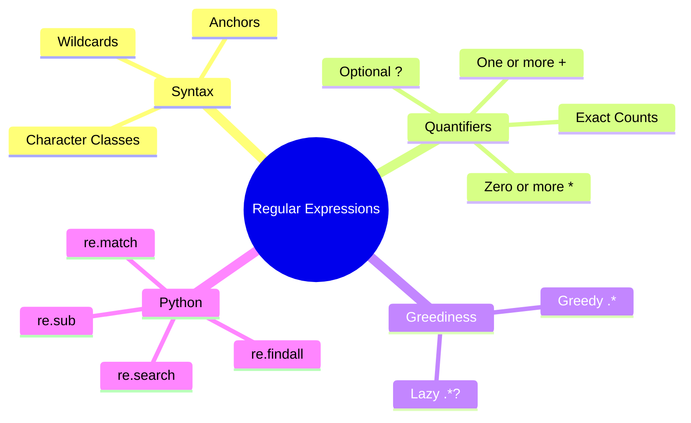

# 04. Regular Expressions

## 1. Topic Overview
This module covers Regular Expressions (Regex), a specialized mini-language used universally in computer science to define and search for complex string patterns.

## 2. Learning Path
1. [Regex Fundamentals](regex-fundamentals.md)
2. [Advanced Regex and Python implementations](advanced-regex-and-python.md)
3. [Regex Applications & Automata](regex-applications.md)

## 3. Real-World Applications
- **Data Scraping**: Extracting every email address and phone number from a massive HTML dump of a website.
- **Form Validation**: Ensuring a user's chosen password contains at least one uppercase letter, one number, and one special character before accepting it.
- **Text Preprocessing**: The underlying engine used to build the text cleaners and tokenizers we discussed in Module 3.

## 4. Difficulty & Importance
- **Mathematical Difficulty**: ★☆☆☆☆ (Low - Based on logic and sets rather than numerical math)
- **Implementation Difficulty**: ★★★☆☆ (Medium - Writing correct regex is notoriously tricky and requires heavy practice)
- **Exam Importance**: **High**. You will almost certainly be asked to write a regex to match a specific pattern (like a phone number), or determine what strings a given regex matches.

## 5. Prerequisites
- [03. Tokenization](../03-tokenization/README.md)

## 6. External Resources
- 📘 **Textbook**: *Speech and Language Processing* (Jurafsky & Martin), Chapter 2.1.
- 🎓 **Interactive Tester**: [Regex101](https://regex101.com) (Highly recommended for practicing).

---

### Can You Explain This?
- [ ] I can explain the difference between `*` and `+`.
- [ ] I can write a regex to extract an email address.
- [ ] I understand the critical difference between Greedy and Lazy (Non-greedy) matching.
- [ ] I know the difference between `re.search()` and `re.match()` in Python.
