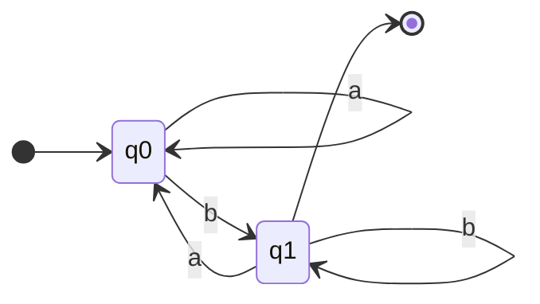

# Deterministic Finite Automata (DFA)

## 1. What is a DFA?
A Deterministic Finite Automaton (DFA) is a specific type of FSA. It is "deterministic" because for every state and every possible input symbol, there is **exactly one** transition. 

In a DFA, you never have to "guess" which path to take. If you are in state $q_1$ and see an 'a', you know exactly which state to go to next.

## 2. DFA Transition Table
A DFA's transition function $\delta$ can be represented as a table, making it very easy to implement in software.

Assume $\Sigma = \{a, b\}$. Let's define a DFA that accepts strings ending in 'b'.
- $Q = \{q_0, q_1\}$
- $q_0$ is the start state.
- $F = \{q_1\}$ is the accepting state.

| Current State | Input 'a' | Input 'b' |
|---|---|---|
| $\rightarrow q_0$ | $q_0$ | $q_1$ |
| $* q_1$ | $q_0$ | $q_1$ |

*(The $\rightarrow$ denotes the start state, and $*$ denotes an accepting state).*

## 3. DFA String Acceptance
Let's trace the input string `"aab"` through the table above.
1. Start at $q_0$.
2. Read 'a': $\delta(q_0, a) \rightarrow q_0$. Current state: $q_0$.
3. Read 'a': $\delta(q_0, a) \rightarrow q_0$. Current state: $q_0$.
4. Read 'b': $\delta(q_0, b) \rightarrow q_1$. Current state: $q_1$.
5. End of string. Is $q_1 \in F$? Yes. The string is **Accepted**.

## 4. DFA State-Diagram Construction
The table above translates directly into this diagram:



## 5. Scratch Implementation
Because a DFA is deterministic, we can easily implement it in Python using a dictionary to represent the transition table.

```python
class DFA:
    def __init__(self, states, alphabet, transition_function, start_state, accept_states):
        self.states = states
        self.alphabet = alphabet
        self.transition_function = transition_function
        self.start_state = start_state
        self.accept_states = accept_states

    def recognize(self, string: str) -> bool:
        current_state = self.start_state
        
        for symbol in string:
            if symbol not in self.alphabet:
                return False # Invalid symbol
            
            # Look up the next state deterministically
            current_state = self.transition_function[current_state][symbol]
            
        # Accepted if the final state is in the set of accept_states
        return current_state in self.accept_states

# Define the DFA that accepts strings ending in 'b'
transitions = {
    'q0': {'a': 'q0', 'b': 'q1'},
    'q1': {'a': 'q0', 'b': 'q1'}
}

dfa = DFA(
    states={'q0', 'q1'},
    alphabet={'a', 'b'},
    transition_function=transitions,
    start_state='q0',
    accept_states={'q1'}
)

print(dfa.recognize("aab")) # True
print(dfa.recognize("aba")) # False
```

## 6. Exam Preparation
### Must Be Able To Calculate
Given a DFA transition diagram and an input string, trace the states manually and state whether it is accepted or rejected.

### Likely Practical Question
**Question**: Draw the state diagram for a DFA over $\Sigma = \{0, 1\}$ that accepts strings containing an even number of 0s.
**Answer**: You need two states: $q_{even}$ (Start and Accept) and $q_{odd}$. 
- If in $q_{even}$, reading a 0 goes to $q_{odd}$. Reading a 1 loops to $q_{even}$.
- If in $q_{odd}$, reading a 0 goes back to $q_{even}$. Reading a 1 loops to $q_{odd}$.
