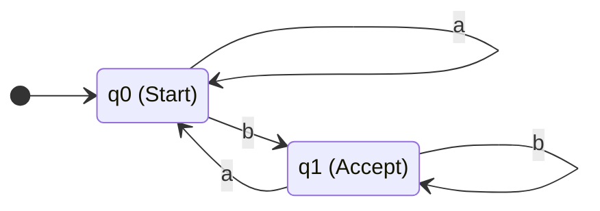

# Deterministic Finite Automata (DFA)

## 1. What is a DFA?
A Deterministic Finite Automaton (DFA) is a specific type of FSA. It is "deterministic" because for every state and every possible input symbol, there is **exactly one** valid transition. 

In a DFA, there is no ambiguity and no branching paths. If you are in state $q_1$ and the machine reads an 'a', you know exactly which state to go to next. The machine never has to "guess" or backtrack. Because of this, DFAs execute extremely fast (in strict $O(N)$ time, where $N$ is the length of the string).

---

## 2. DFA Transition Table
A DFA's transition function $\delta$ can be represented as a 2D matrix or table, making it very easy to implement in software.

Assume an alphabet $\Sigma = \{a, b\}$. Let's define a DFA that accepts strings ending in 'b'.
- $Q = \{q_0, q_1\}$
- $q_0$ is the start state.
- $F = \{q_1\}$ is the accepting state.

| Current State | Input 'a' | Input 'b' |
| :---: | :---: | :---: |
| $\rightarrow q_0$ | $q_0$ | $q_1$ |
| $* q_1$ | $q_0$ | $q_1$ |

*(The $\rightarrow$ denotes the start state, and $*$ denotes an accepting state).*

### Tracing String Acceptance
Let's trace the input string `"aab"` through the table above.

| Step | Current State | Symbol Read | Next State Lookup $\delta(q, x)$ | New State |
| :---: | :---: | :---: | :--- | :---: |
| 1 | $q_0$ | `a` | $\delta(q_0, a) \rightarrow q_0$ | $q_0$ |
| 2 | $q_0$ | `a` | $\delta(q_0, a) \rightarrow q_0$ | $q_0$ |
| 3 | $q_0$ | `b` | $\delta(q_0, b) \rightarrow q_1$ | $q_1$ |

**Conclusion**: End of string reached. The current state is $q_1$. Since $q_1 \in F$, the string is **Accepted**.

---

## 3. Visualizing the DFA
The table above translates directly into this state diagram:



---

## 4. Scratch Implementation
Because a DFA is fully deterministic, we can easily implement it in Python using a nested dictionary to represent the transition table. Notice there is no recursion or backtracking required.

```python
class DFA:
    def __init__(self, states, alphabet, transitions, start_state, accept_states):
        self.alphabet = alphabet
        self.transitions = transitions
        self.start_state = start_state
        self.accept_states = accept_states

    def recognize(self, text: str) -> bool:
        current_state = self.start_state
        
        for symbol in text:
            if symbol not in self.alphabet:
                return False # Invalid symbol crashes the machine
            
            # Look up the next state deterministically O(1)
            current_state = self.transitions[current_state][symbol]
            
        # Accepted if the final halted state is in the set of accept_states
        return current_state in self.accept_states

# Define the DFA that accepts strings ending in 'b'
transition_table = {
    'q0': {'a': 'q0', 'b': 'q1'},
    'q1': {'a': 'q0', 'b': 'q1'}
}

dfa = DFA(
    states={'q0', 'q1'},
    alphabet={'a', 'b'},
    transitions=transition_table,
    start_state='q0',
    accept_states={'q1'}
)
```

### Try It Yourself
??? question "Trace the code on this input"
    **Input:** `dfa.recognize("aba")`
    
    **Output:** `False`
    
    *Trace: Start at `q0`. Read 'a', stay at `q0`. Read 'b', go to `q1`. Read 'a', go back to `q0`. The string ends. Is `q0` in the accept states (`{'q1'}`)? No. Return False.*

---

## 5. Exam Preparation

### How to Write This in an Exam

**5-Mark Question**: Draw the state diagram for a DFA over $\Sigma = \{0, 1\}$ that accepts strings containing an even number of 0s. Justify your design.
> **Answer**: 
> I will design a DFA with two states: $q_{even}$ (which acts as both the Start and Accept state) and $q_{odd}$. 
> - A string with zero '0's is even, so the start state $q_{even}$ must be accepting.
> - If the machine is in $q_{even}$ and reads a `0`, it transitions to $q_{odd}$. If it reads a `1`, it loops back to $q_{even}$ (because a 1 does not change the parity of 0s).
> - If the machine is in $q_{odd}$ and reads a `0`, it transitions back to $q_{even}$. If it reads a `1`, it loops back to $q_{odd}$.
> *(Student should draw the corresponding state diagram here).*

**2-Mark Question**: What is the algorithmic time complexity of processing a string of length $N$ through a DFA?
> **Answer**: $O(N)$. The machine performs exactly one deterministic transition per character, with no backtracking.

---

### Can You Explain This?
- [ ] I can trace a string through a DFA transition table.
- [ ] I can implement a basic DFA in Python using a dictionary.
- [ ] I understand why a DFA executes in linear $O(N)$ time.
- [ ] I can draw a DFA that accepts an even number of a specific character.
