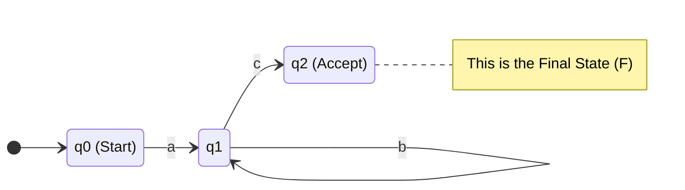

# Finite State Automata Fundamentals

## 1. What Is It?
A Finite State Automaton (FSA), plural Automata, is a theoretical mathematical model of computation. It consists of a finite number of states, and it transitions from one state to another based on inputs it reads. In NLP, FSAs are the underlying mathematical engines that power Regular Expressions and morphological analyzers.

---

## 2. Intuition
Imagine a physical turnstile at a subway station.
- It has exactly two **states**: `Locked` and `Unlocked`.
- It accepts exactly two **inputs**: `Coin` and `Push`.

If you map out its behavior:
- If you input a `Coin` while it is `Locked`, it transitions to `Unlocked`.
- If you input a `Push` while it is `Unlocked`, you pass through, and it transitions back to `Locked`.
- Any other input (e.g., `Push` while `Locked`) keeps it in the same state (it ignores the input and stays locked).

This is a simple FSA.

---

## 3. Formal Definition: The 5-Tuple
Mathematically, an FSA is defined precisely by a 5-tuple (a set of 5 mathematical objects): 

!!! abstract "The Formal FSA Definition"
    $$ M = (Q, \Sigma, \delta, q_0, F) $$

| Symbol | Name | Definition | Example |
| :---: | :--- | :--- | :--- |
| **$Q$** | States | A finite, non-empty set of all possible states. | $\{q_0, q_1, q_2\}$ |
| **$\Sigma$** | Alphabet | A finite set of all valid input symbols. | $\{a, b, c\}$ |
| **$q_0$** | Initial State | The single state where the machine always starts. Must be an element of $Q$. | $q_0 \in Q$ |
| **$F$** | Final States | The set of accepting states. It can be empty, one, or many states. | $F \subseteq Q$ |
| **$\delta$** | Transition Function | A function mapping a state and an input symbol to the next state: $\delta(q, a) \rightarrow q'$. | $\delta(q_0, a) = q_1$ |

---

## 4. State Diagram Representation
FSAs are frequently drawn as directed graphs to visualize the transition function $\delta$.

- **Nodes (Circles)**: Represent the states ($Q$).
- **Edges (Arrows)**: Represent the transitions ($\delta$), labeled with symbols from the alphabet ($\Sigma$).
- **Start Arrow**: An arrow coming from nowhere pointing to the initial state ($q_0$).
- **Double Circle**: Represents an accepting/final state ($F$).

### Example: The Automaton for Regex `ab*c`

*In this diagram, the machine starts at `q0`. It must read an 'a' to reach `q1`. At `q1`, it can loop infinitely reading 'b's. Finally, reading a 'c' moves it to `q2`, the accepting state.*

---

## 5. How an FSA "Accepts" a String
For a string of text to be considered **accepted** (valid) by the FSA, it must meet two strict conditions:
1. The machine must successfully read the **entire string** without crashing (i.e., there must be a valid transition for every character).
2. After the *very last character* is read, the machine must be currently sitting in a state that belongs to the set of final states $F$.

---

## 6. Exam Preparation

### How to Write This in an Exam

**5-Mark Question**: Formally define a Finite State Automaton using the 5-tuple, and explain what happens if an FSA finishes reading an input string and is currently in state $q_2$, but $q_2 \notin F$.
> **Answer**: 
> An FSA is defined as $M = (Q, \Sigma, \delta, q_0, F)$ where:
> 1. $Q$ is a finite set of states.
> 2. $\Sigma$ is a finite alphabet of input symbols.
> 3. $\delta$ is the transition function mapping $Q \times \Sigma \rightarrow Q$.
> 4. $q_0$ is the start state ($q_0 \in Q$).
> 5. $F$ is the set of final/accepting states ($F \subseteq Q$).
>
> If the machine finishes reading the input string and halts in state $q_2$, but $q_2$ is not a member of the final states set $F$, the string is **rejected**. For a string to be accepted, the automaton must finish reading the *entire* sequence and halt on a valid final state.

---

### Can You Explain This?
- [ ] I can write down the 5 symbols of the 5-tuple from memory.
- [ ] I can explain the difference between the alphabet $\Sigma$ and the set of states $Q$.
- [ ] I can draw the state diagram for the regex `ab*c`.
- [ ] I can list the two conditions required for a string to be "accepted".
