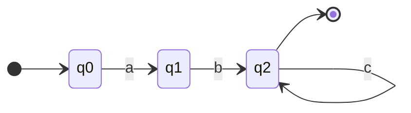

# Finite State Automata Fundamentals

## 1. What Is It?
A Finite State Automaton (FSA), plural Automata, is a theoretical mathematical model of computation. It consists of a finite number of states, and it transitions from one state to another based on inputs it reads. In NLP, FSAs are the underlying engines that power Regular Expressions and morphological analyzers.

## 2. Intuition
Imagine a turnstile at a subway.
- It has two **states**: `Locked` and `Unlocked`.
- It has two **inputs**: `Coin` and `Push`.
- If you input a `Coin` while it is `Locked`, it transitions to `Unlocked`.
- If you input a `Push` while it is `Unlocked`, you pass through, and it transitions back to `Locked`.
- Any other input (e.g., `Push` while `Locked`) keeps it in the same state.

This is a simple FSA.

## 3. Formal Definition: The 5-Tuple
Mathematically, an FSA is defined by a 5-tuple: $M = (Q, \Sigma, \delta, q_0, F)$

- **$Q$**: A finite set of **states** (e.g., $\{q_0, q_1, q_2\}$).
- **$\Sigma$**: A finite set of input symbols, called the **alphabet** (e.g., $\{a, b, c\}$).
- **$q_0$**: The **initial state**, where the machine always starts ($q_0 \in Q$).
- **$F$**: The set of **accepting (or final) states** ($F \subseteq Q$). If the machine finishes reading the input and is in an accepting state, the input is "accepted."
- **$\delta$**: The **transition function**, which maps a state and an input symbol to the next state: $\delta(q, a) \rightarrow q'$.

## 4. State Diagram Representation
FSAs are frequently drawn as directed graphs.
- **Nodes (Circles)**: Represent the states ($Q$).
- **Edges (Arrows)**: Represent the transitions ($\delta$), labeled with symbols from the alphabet ($\Sigma$).
- **Start Arrow**: An arrow coming from nowhere pointing to the initial state ($q_0$).
- **Double Circle**: Represents an accepting/final state ($F$).

*(In this diagram, `q2` acts as the accepting state).*

## 5. Regex to Automaton Concept
As mentioned in the Regex module, every Regular Expression can be perfectly translated into an FSA.
- The regex `ab*` matches "a", "ab", "abb".
- The equivalent FSA would transition on 'a' to an accepting state, and then loop on 'b' staying in that accepting state.

## 6. Exam Preparation
### Must Memorize
- The 5-tuple definition $M = (Q, \Sigma, \delta, q_0, F)$ and what each symbol means.

### Likely Theory Question
**Question**: What happens if an FSA finishes reading an input string and is currently in state $q_2$, but $q_2 \notin F$?
**Answer**: The string is **rejected**. For a string to be accepted, the automaton must finish reading the *entire* string and end up in a state that belongs to the set of final states $F$.
