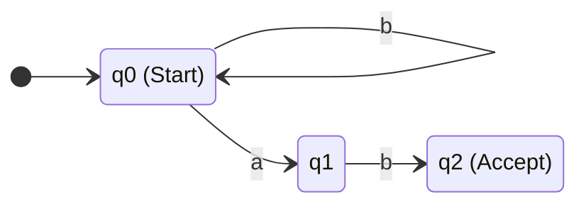

# Nondeterministic Finite Automata (NFA)

## 1. What is an NFA?
A Nondeterministic Finite Automaton (NFA) relaxes the strict, rigid rules of a DFA. In an NFA:
1. **Multiple Transitions**: A single state can have *multiple* valid transitions for the *same* input symbol.
2. **Missing Transitions**: A state might have *no* valid transition for a specific input symbol (which causes that specific path to die/reject).
3. **Epsilon ($\epsilon$) Transitions**: An NFA can transition from one state to another *without reading any input symbol at all*.

---

## 2. Intuition
Imagine walking through a physical maze. 
- In a **DFA**, at every intersection, there is exactly one sign telling you which way to go based on the color of your ticket. You just follow the signs.
- In an **NFA**, you might arrive at an intersection and see *two* signs pointing in different directions for a "red" ticket. You have to "guess" which path leads to the exit. If you guess wrong and hit a dead end, you have to magically clone yourself, backtrack, and try the other path.

An NFA **accepts** a string if there exists *at least one* valid path through the machine that consumes the entire string and ends in an accepting state, even if 99 other paths crashed.

---

## 3. DFA vs NFA Comparison

| Feature | DFA | NFA |
| :--- | :--- | :--- |
| **Transitions per symbol** | Exactly one | Zero, one, or multiple |
| **Empty transitions ($\epsilon$)**| Not allowed | Allowed |
| **Execution Complexity** | Simple, linear $O(N)$ | Complex, requires search/backtracking $O(2^N)$ without parallel state tracking |
| **Expressive Power** | Equal | Equal (Kleene's Theorem) |

> [!NOTE]
> **Why use NFAs if they are slower?**
> Even though NFAs require complex backtracking or parallel state tracking (making them slower to execute than DFAs), they are vastly easier to construct from Regular Expressions. When you compile a Regex in Python, the engine first builds an NFA because the logic perfectly mirrors the regex syntax tree. It then converts that NFA into a highly optimized DFA for actual execution.

---

## 4. Visualizing an NFA
Let's build an NFA that accepts strings ending in 'ab' over the alphabet $\{a, b\}$.
Notice how state `q0` has TWO paths for the input `a`.



---

## 5. Scratch Implementation (NFA Recognizer)
Because an NFA can be in multiple states simultaneously due to branching and epsilon transitions, we implement it by keeping track of the *set* of all possible states the machine could currently be in at any given timestep.

```python
class NFA:
    def __init__(self, states, alphabet, transitions, start_state, accept_states):
        self.alphabet = alphabet
        self.transitions = transitions
        self.start_state = start_state
        self.accept_states = accept_states

    def get_epsilon_closure(self, state_set: set) -> set:
        """Finds all states reachable via empty string (epsilon) transitions."""
        closure = set(state_set)
        stack = list(state_set)
        
        while stack:
            current = stack.pop()
            # If there are epsilon transitions ('') from this state
            if current in self.transitions and '' in self.transitions[current]:
                for next_state in self.transitions[current]['']:
                    if next_state not in closure:
                        closure.add(next_state)
                        stack.append(next_state)
        return closure

    def recognize(self, text: str) -> bool:
        # Start at the epsilon closure of the start state
        current_states = self.get_epsilon_closure({self.start_state})
        
        for symbol in text:
            if symbol not in self.alphabet:
                return False
                
            next_states = set()
            for state in current_states:
                # If there's a transition for this symbol from this active state
                if state in self.transitions and symbol in self.transitions[state]:
                    for target_state in self.transitions[state][symbol]:
                        next_states.add(target_state)
            
            # Update current states, including any new epsilon transitions
            current_states = self.get_epsilon_closure(next_states)
            
        # Accept if the intersection of current states and accept states is not empty
        return not current_states.isdisjoint(self.accept_states)
```

### Try It Yourself

??? question "Trace the code on the 'ends with ab' NFA"
    **Setup:**
    ```python
    transitions = {
        'q0': {'a': ['q0', 'q1'], 'b': ['q0']},
        'q1': {'b': ['q2']},
        'q2': {}
    }
    nfa = NFA(states={'q0', 'q1', 'q2'}, alphabet={'a', 'b'}, 
              transitions=transitions, start_state='q0', accept_states={'q2'})
    ```
    
    **Input:** `nfa.recognize("aab")`
    **Trace:**
    - Start: `{'q0'}`
    - Read 'a': Transition `q0` on 'a' goes to `q0` and `q1`. Current states: `{'q0', 'q1'}`.
    - Read 'a': Transition `q0` on 'a' goes to `q0`, `q1`. Transition `q1` on 'a' crashes (no path). Current states: `{'q0', 'q1'}`.
    - Read 'b': Transition `q0` on 'b' goes to `q0`. Transition `q1` on 'b' goes to `q2`. Current states: `{'q0', 'q2'}`.
    - End of string. Is `q2` in accept states? **Yes.**

---

## 6. Exam Preparation

### How to Write This in an Exam

**5-Mark Question**: Define an Epsilon ($\epsilon$) transition in the context of an NFA, and explain its role in the `epsilon_closure` algorithm.
> **Answer**: An Epsilon ($\epsilon$) transition allows a Nondeterministic Finite Automaton to change its state without consuming any input symbol from the string. The `epsilon_closure` of a state $q$ is defined as the set containing $q$ itself, plus all states that can be reached from $q$ by following one or more $\epsilon$-transitions. When executing an NFA programmatically, taking the epsilon closure of the active states ensures that the machine accurately tracks all possible parallel states it could reside in before reading the next physical character.

---

### Can You Explain This?
- [ ] I can list 3 differences between an NFA and a DFA.
- [ ] I can explain what an $\epsilon$-transition is.
- [ ] I can explain the logic behind tracking a `set()` of current states rather than a single state when coding an NFA.
- [ ] I understand why an NFA is easier to construct from a Regex than a DFA.
