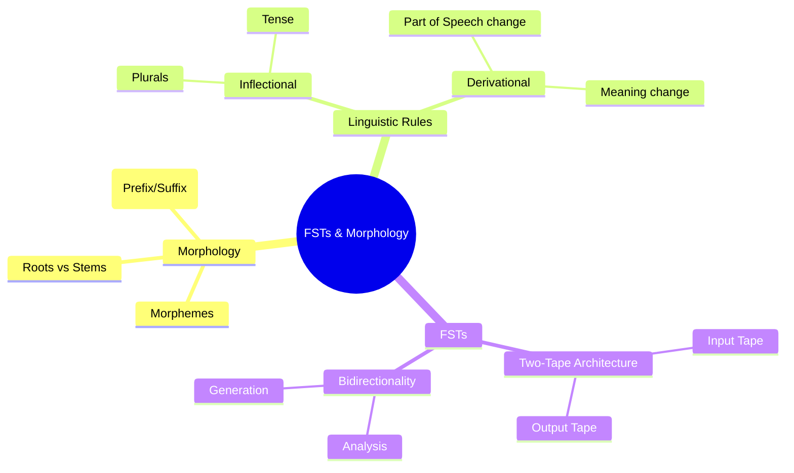

# 06. Finite State Transducers & Morphology

## 1. Topic Overview
This module introduces **Morphology** (the linguistic study of how words are formed from smaller units) and **Finite State Transducers** (FSTs), the computational engines used to mathematically model morphological rules.

## 2. Learning Path
1. [Morphology Fundamentals](morphology-fundamentals.md)
2. [Finite State Transducers](finite-state-transducers.md)

## 3. Real-World Applications
- **Handling Unknown Words**: If a search engine encounters the word "antidisestablishmentarianisms", it won't be in a standard dictionary. An FST-based morphological analyzer breaks it down into known roots and affixes so the system can infer its meaning.
- **Spell Checkers**: FSTs can generate all valid morphological variants of a root word to verify if a user's spelling is linguistically possible.
- **Machine Translation**: In morphologically rich languages like Turkish or Finnish, a single word can contain the meaning of an entire English sentence. FSTs are required to parse the sentence out of the single word before translating.

## 4. Difficulty & Importance
- **Mathematical Difficulty**: ★☆☆☆☆ (Very Low)
- **Implementation Difficulty**: ★★★☆☆ (Medium - Understanding the two-tape FST concept in code requires careful tracking)
- **Exam Importance**: **Medium-High**. The distinction between inflectional and derivational morphology is a guaranteed multiple-choice or short-answer question. You may also be asked to draw an FST for a simple spelling rule (like `y` to `ies`).

## 5. Prerequisites
- [05. Finite State Automata](../05-finite-state-automata/README.md)

## 6. External Resources
- 📘 **Textbook**: *Speech and Language Processing* (Jurafsky & Martin), Chapter 3.
- 🎓 **Advanced Reading**: [Finite State Morphology](https://web.stanford.edu/~jurafsky/slp3/3.pdf)

---

### Can You Explain This?
- [ ] I can distinguish between a Morph, a Morpheme, and an Allomorph.
- [ ] I can explain the difference between Inflectional and Derivational morphology.
- [ ] I understand how a Finite State Transducer differs from a Finite State Automaton.
- [ ] I can explain what is meant by the "bidirectionality" of an FST.
