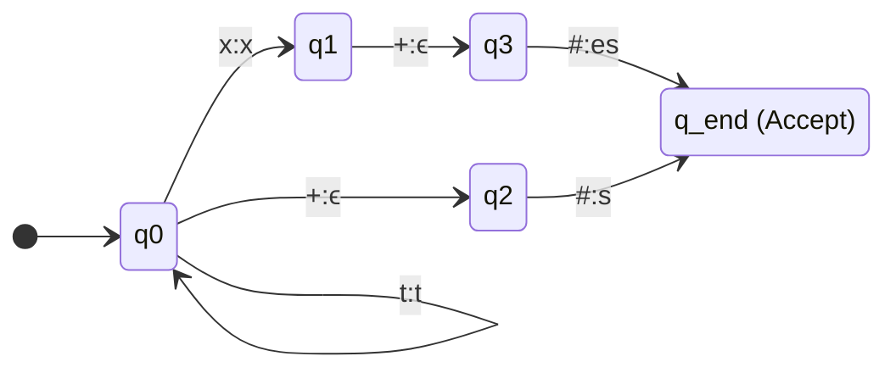

# Finite State Transducers

## 1. What is an FST?
A Finite State Transducer (FST) is an extension of a Finite State Automaton (FSA). 
- An **FSA** reads a single input string and *recognizes* (accepts/rejects) it. It is a one-tape machine.
- An **FST** reads an input string and *translates* it into an output string. It is a two-tape machine (one tape for input, one tape for output).

---

## 2. Input/Output Transitions
In an FSA, transitions are labeled with a single character `a`.
In an FST, transitions are labeled with pairs `a:b`. 
- `a` is the input symbol to read from the first tape.
- `b` is the output symbol to write to the second tape.

An FST transition $\delta(q_0, a:b) \rightarrow q_1$ means: "If in state $q_0$ and the input tape reads `a`, transition to $q_1$ and write `b` to the output tape."

### Epsilon Transitions in FSTs
Empty transitions ($\epsilon$) are extremely useful in FSTs for handling morphological insertions and deletions.
- **Deletion (`a:ϵ`)**: "Read 'a', output nothing."
- **Insertion (`ϵ:a`)**: "Read nothing, output 'a'."

---

## 3. The Power of Bidirectionality
FSTs are inherently bidirectional. The exact same mathematical state machine can be run forwards or backwards.

### Generation (Lexical to Surface)
Inputting abstract morphological features to get a real, spellable word.
- **Input Tape**: `cat + N + PL`
- **Output Tape**: `cats`

### Analysis (Surface to Lexical)
Running the machine in reverse: inputting a real word to get its abstract linguistic features.
- **Input Tape**: `cats`
- **Output Tape**: `cat + N + PL`

Because FSTs handle non-determinism, feeding an ambiguous word like `leaves` into the analyzer side of the FST will legally output *both* `leaf + N + PL` and `leave + V + 3SG` by following two different valid paths through the machine.

---

## 4. Visualizing an FST
Let's build a visual FST that handles regular plurals (`cat` $\rightarrow$ `cats`) and the English `x` rule (`box` $\rightarrow$ `boxes`).
- Input format: `word+#` (where `#` denotes the plural command).


*Notice how reading the `+` command outputs an `ϵ` (nothing), effectively deleting it from the surface spelling.*

---

## 5. Scratch Implementation (Plural FST)

```python
class FST:
    def __init__(self, states, transitions, start_state, accept_states):
        self.transitions = transitions
        self.start_state = start_state
        self.accept_states = accept_states

    def transduce(self, input_string: str) -> list[str]:
        # Stores (current_state, remaining_input_tape, output_tape_so_far)
        paths = [(self.start_state, input_string, "")]
        successful_outputs = []

        while paths:
            state, remaining, output = paths.pop()

            # If we reached the end of the input tape and are in an accept state
            if not remaining and state in self.accept_states:
                successful_outputs.append(output)
                continue
                
            if not remaining:
                continue

            current_char = remaining[0]
            next_remaining = remaining[1:]

            # Look for matching transitions in the current state
            if state in self.transitions:
                for (in_char, out_char), next_state in self.transitions[state].items():
                    
                    # 1. Standard character match
                    if in_char == current_char:
                        paths.append((next_state, next_remaining, output + out_char))
                    
                    # 2. Epsilon input transition (consumes no input from tape!)
                    elif in_char == 'ϵ':
                        paths.append((next_state, remaining, output + out_char))
                    
                    # 3. Wildcard matcher (copies any letter for the stem)
                    elif in_char == '*':
                        paths.append((next_state, next_remaining, output + current_char))
        
        return successful_outputs
```

### Try It Yourself

??? question "Trace the code on 'box+#'"
    **Setup:**
    ```python
    # + denotes boundary, # denotes plural
    transitions = {
        'q0': {('x', 'x'): 'q1', ('+', 'ϵ'): 'q2', ('*', ''): 'q0'},
        'q1': {('+', 'ϵ'): 'q3'},
        'q2': {('#', 's'): 'q_end'},
        'q3': {('#', 'es'): 'q_end'}
    }
    fst = FST(states={'q0', 'q1', 'q2', 'q3', 'q_end'}, transitions=transitions, 
              start_state='q0', accept_states={'q_end'})
    ```
    
    **Input:** `fst.transduce("box+#")`
    **Trace:**
    1. Read `b` using `*`, loop in `q0`. Output: `b`.
    2. Read `o` using `*`, loop in `q0`. Output: `bo`.
    3. Read `x`, follow explicit transition to `q1`. Output: `box`.
    4. Read `+`, follow transition to `q3` and output `ϵ`. Output: `box`.
    5. Read `#`, follow transition to `q_end` and output `es`. Output: `boxes`.
    **Final Result:** `['boxes']`

---

## 6. Exam Preparation

### How to Write This in an Exam

**5-Mark Question**: Why are FSTs strictly superior to standard dictionary lookups for morphological analysis in production NLP systems? Give an example involving morphologically rich languages.
> **Answer**: A dictionary maps every surface form directly to its lemma and features. This requires massive memory storage. For English, this is somewhat manageable, but for morphologically rich/agglutinative languages like Turkish or Finnish, a single root word can generate millions of valid word forms through stacked affixes. It is impossible to store all combinations in a dictionary. An FST, however, encapsulates the mathematical *rules* of the morphology. It can analyze entirely novel, mathematically valid word combinations it has never seen before with very low memory overhead, running in strict linear time.

**2-Mark Question**: What does the transition `ϵ:a` accomplish in a Finite State Transducer?
> **Answer**: It performs an insertion. The machine transitions to the next state without consuming any character from the input tape, but writes the character 'a' to the output tape.

---

### Can You Explain This?
- [ ] I can list 2 differences between an FSA and an FST.
- [ ] I understand what an `ϵ` input transition does vs an `ϵ` output transition.
- [ ] I can define Morphological Generation vs Morphological Analysis.
- [ ] I can trace the Python FST code for the input `"cat+#"`.
