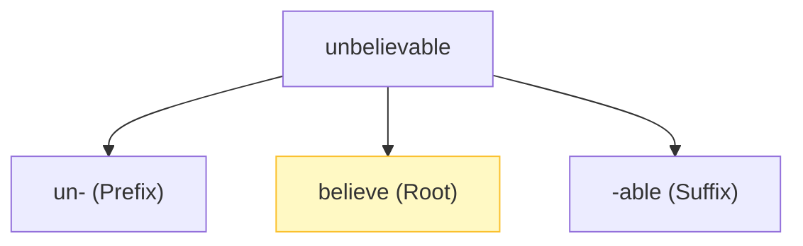

# Morphology Fundamentals

## 1. What Is Morphology?
Morphology is the study of the internal structure of words and how they are mathematically and linguistically formed. Just as syntax dictates how words combine to form sentences, morphology dictates how smaller atomic units combine to form words.

---

## 2. Morphs and Morphemes
- **Morpheme**: The smallest *meaning-bearing unit* in a language. (An abstract concept).
- **Morph**: The physical realization (the actual spelling or sounds) of a morpheme.

For example, the word "unbelievable" has three distinct morphemes:
1. `un-` (meaning "not")
2. `believe` (the core action)
3. `-able` (meaning "capable of being")

---

## 3. Roots, Stems, and Affixes
- **Root**: The primary lexical unit of a word, carrying the most significant aspects of semantic content. It cannot be reduced further (e.g., "believe").
- **Stem**: The root plus any derivational affixes. It is the base to which inflectional affixes are added.
- **Affixes**: Bound morphemes that attach to roots/stems. They include:
  - **Prefixes**: Attach to the front (e.g., **un**happy).
  - **Suffixes**: Attach to the end (e.g., happi**ness**).
  - **Infixes**: Inserted inside the root (rare in English, but common in languages like Tagalog).

### Visualizing Word Structure

---

## 4. Inflectional vs Derivational Morphology

This is the most critical distinction in this module.

### Inflectional Morphology
Modifies a word to express different grammatical categories (like tense, mood, person, number, case) **without** changing its core meaning or its part of speech.
- **Number**: cat (Noun) $\rightarrow$ cats (Noun)
- **Tense**: walk (Verb) $\rightarrow$ walked (Verb)
- **Person**: I run (Verb) $\rightarrow$ He runs (Verb)

### Derivational Morphology
Creates an entirely **new word** with a new core meaning, often completely changing the part of speech.
- **Verb $\rightarrow$ Noun**: compute $\rightarrow$ computer
- **Adjective $\rightarrow$ Adverb**: quick $\rightarrow$ quickly
- **Noun $\rightarrow$ Adjective**: magic $\rightarrow$ magical

---

## 5. English Morphological Rules
English morphology is relatively simple compared to languages like Russian or Turkish, but it is riddled with exceptions.

### Regular Noun Plurals
- **Default rule**: Add `-s` (cat $\rightarrow$ cats).
- **Ends in s, z, x, ch, sh**: Add `-es` (box $\rightarrow$ boxes).
- **Ends in consonant + y**: Change y to i, add `-es` (city $\rightarrow$ cities).

### Irregular Morphology
English is heavily influenced by Old English and Germanic roots, leaving many words highly irregular. They completely ignore the standard suffix rules.
- **Nouns**: child $\rightarrow$ children, mouse $\rightarrow$ mice, sheep $\rightarrow$ sheep.
- **Verbs**: go $\rightarrow$ went, be $\rightarrow$ was/were.

---

## 6. Morphological Analysis and Ambiguity
The NLP task of breaking down a surface word into its constituent morphemes. The standard output format usually looks like: `word + PartOfSpeech + Features`
- `cats` $\rightarrow$ `cat + N + PL` (Noun, Plural)
- `walked` $\rightarrow$ `walk + V + PAST` (Verb, Past Tense)

### Ambiguity
A single surface form can map to multiple valid morphological analyses depending on the context.
- **"leaves"**: 
  - `leaf + N + PL` (The *leaves* on the tree).
  - `leave + V + 3SG` (He *leaves* the house).
Context (via Part-of-Speech tagging) is required to resolve this ambiguity.

---

## 7. Exam Preparation

### How to Write This in an Exam

**5-Mark Question**: Define and strictly contrast Inflectional and Derivational morphology. Provide two clear examples of each.
> **Answer**: 
> - **Inflectional morphology** modifies a word to express grammatical information (such as tense or plurality) but strictly preserves the word's fundamental meaning and its Part of Speech. Examples: `jump` (Verb) $\rightarrow$ `jumps` (Verb, 3rd person singular), `apple` (Noun) $\rightarrow$ `apples` (Noun, plural).
> - **Derivational morphology** creates a fundamentally new lexical item, changing the core meaning and frequently changing the Part of Speech. Examples: `happy` (Adjective) $\rightarrow$ `happiness` (Noun), `teach` (Verb) $\rightarrow$ `teacher` (Noun).

**3-Mark Question**: Perform a morphological analysis on the word "geese", specifying the root, POS, and features.
> **Answer**: `goose + N + PL`

---

### Can You Explain This?
- [ ] I can define Morpheme, Root, and Affix.
- [ ] I can state the exact difference between Inflectional and Derivational morphology.
- [ ] I can explain why morphological analysis is ambiguous.
