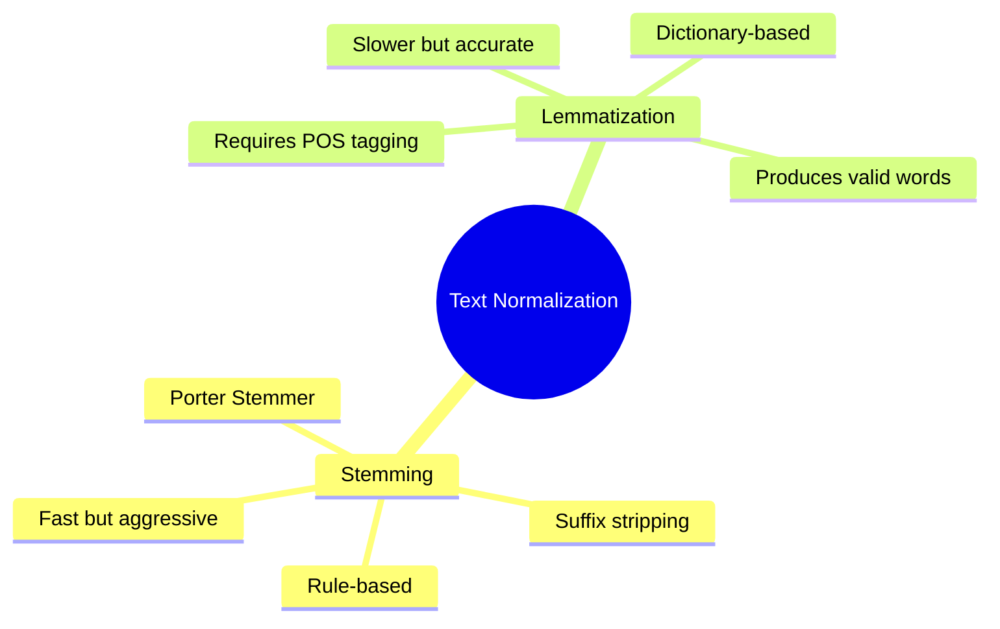

# 07. Stemming & Lemmatization

## 1. Topic Overview
This module covers two foundational preprocessing techniques used to reduce morphological variants of words to their base forms. This is a critical step in traditional NLP pipelines to reduce vocabulary size and group semantically equivalent words together.

## 2. Learning Path
1. [Stemming](stemming.md)
2. [Lemmatization](lemmatization.md)
3. [Stemming vs Lemmatization](stemming-vs-lemmatization.md)

## 3. Real-World Applications
- **Search Engines (Information Retrieval)**: If a user searches for "how to fix running shoes", they expect results containing "runs" and "ran". Normalizing both the search query and the document database ensures these linguistic variations match successfully.
- **Topic Modeling**: Counting word frequencies is useless if `computer`, `computers`, and `computing` are counted as three entirely unrelated features. Normalization merges them into a single feature count.

## 4. Difficulty & Importance
- **Mathematical Difficulty**: ★☆☆☆☆ (Very Low)
- **Implementation Difficulty**: ★☆☆☆☆ (Very Low - Basic string matching and dictionary lookups)
- **Exam Importance**: **Extremely High**. "Compare and contrast Stemming and Lemmatization" is one of the most common standard exam questions in any introductory NLP course. You must be able to reproduce the comparison table from memory.

## 5. Prerequisites
- [06. Finite State Transducers & Morphology](../06-finite-state-transducers-and-morphology/README.md)

## 6. External Resources
- 📘 **Textbook**: *Speech and Language Processing* (Jurafsky & Martin), Chapter 2.4.4.

---

### Can You Explain This?
- [ ] I can explain why a stemmed word does not need to be a valid English word.
- [ ] I can list the key differences between Stemming and Lemmatization in speed, accuracy, and mechanism.
- [ ] I understand why Lemmatizers require Part-of-Speech tags to function correctly.
- [ ] I understand why modern Deep Learning pipelines (like BERT or GPT) usually do not use stemming or lemmatization.
