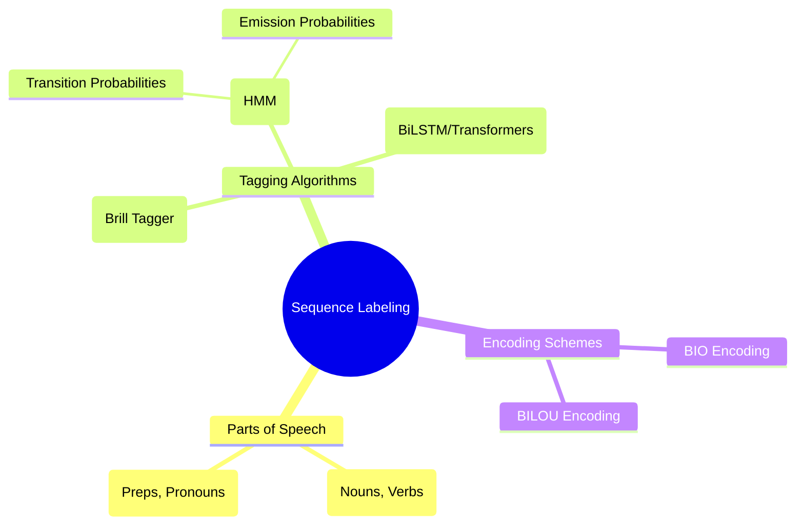

# 08. POS Tagging & Sequence Labeling

## 1. Topic Overview
This module covers Part-of-Speech (POS) tagging, the first major "Sequence Labeling" task in NLP, where every word in an input sequence must be assigned a corresponding linguistic label.

## 2. Learning Path
1. [Parts of Speech](parts-of-speech.md)
2. [Sequence Labeling Fundamentals](sequence-labeling-fundamentals.md)
3. [POS Tagging Algorithms](pos-tagging-algorithms.md)

## 3. Real-World Applications
- **Resolving Ambiguity**: Words in English are highly ambiguous. Is "book" a noun (a physical object) or a verb (to reserve a flight)? Without resolving this ambiguity via POS tagging, downstream systems cannot accurately determine meaning.
- **Syntactic Parsing**: A parser needs to know if a word is an adjective or a noun before it can build a syntax tree representing the sentence structure.
- **Named Entity Recognition (NER)**: The sequence labeling concepts learned here (like BIO encoding) are the exact same concepts used to extract names, locations, and dates from raw text.

## 4. Difficulty & Importance
- **Mathematical Difficulty**: ★★★☆☆ (Medium - Understanding HMM probability formulas requires focus)
- **Implementation Difficulty**: ★★★★☆ (High - The Viterbi algorithm is a classic dynamic programming challenge)
- **Exam Importance**: **Extremely High**. Hidden Markov Models (HMMs) and Viterbi decoding are foundational concepts in classical NLP and Speech Recognition. Calculating tag probabilities by hand is a guaranteed exam question.

## 5. Prerequisites
- Basic understanding of conditional probability.

## 6. External Resources
- 📘 **Textbook**: *Speech and Language Processing* (Jurafsky & Martin), Chapter 8.

---

### Can You Explain This?
- [ ] I can distinguish between Open and Closed word classes.
- [ ] I can explain what BIO encoding stands for and how it handles multi-word entities.
- [ ] I can explain the difference between a Transition probability and an Emission probability in an HMM.
- [ ] I can explain *why* the Viterbi algorithm is needed (what happens if we just use a greedy search?).
