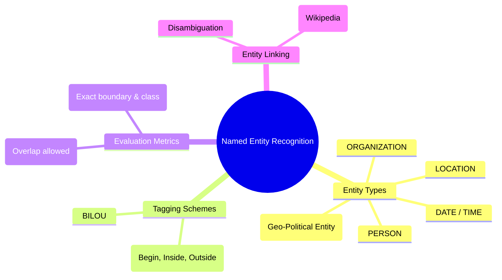

# 09. Named Entity Recognition

## 1. Topic Overview
This module covers Named Entity Recognition (NER), the critical Information Extraction process of locating and classifying proper nouns (people, places, organizations) and numerical data (dates, money) within raw text.

## 2. Learning Path
1. [Named Entity Recognition Fundamentals](ner-fundamentals.md)
2. [NER Tagging and Evaluation](ner-tagging-and-evaluation.md)
3. [Entity Linking](entity-linking.md)

## 3. Real-World Applications
- **Financial Intelligence**: If you want to build a trading algorithm that reads financial news and alerts you whenever a specific `ORGANIZATION` announces a `MONEY` amount regarding an acquisition, you must use an NER model.
- **Customer Support Routing**: Automatically scanning incoming support tickets to extract `PRODUCT_NAME` and `ORDER_ID` to route the ticket to the correct specialized department.
- **Search Enhancement**: Instead of just matching keywords, modern search engines extract entities from your query to understand that "Washington" refers to `PERSON` (George Washington) vs `GPE` (Washington State) depending on the context.

## 4. Difficulty & Importance
- **Mathematical Difficulty**: ★☆☆☆☆ (Very Low - Basic Precision/Recall concepts)
- **Implementation Difficulty**: ★★☆☆☆ (Low - The BIO extraction logic requires some careful loop tracking in Python)
- **Exam Importance**: **High**. Expect to be given a raw sentence and asked to manually tag it using BIO format for specified entities. You may also be asked to distinguish between NER and Entity Linking.

## 5. Prerequisites
- [08. POS Tagging & Sequence Labeling](../08-pos-tagging-and-sequence-labeling/README.md)

## 6. External Resources
- 📘 **Textbook**: *Speech and Language Processing* (Jurafsky & Martin), Chapter 8.3 & 17.1.

---

### Can You Explain This?
- [ ] I can list the four most common CoNLL-2003 entity types.
- [ ] I understand why pronouns (like "he" or "she") are not tagged as entities.
- [ ] I can extract multi-word entities programmatically from a list of BIO tags.
- [ ] I can explain the difference between a Strict NER evaluation and a Partial NER evaluation.
- [ ] I understand the difference between extracting an entity (NER) and disambiguating it (Entity Linking).
