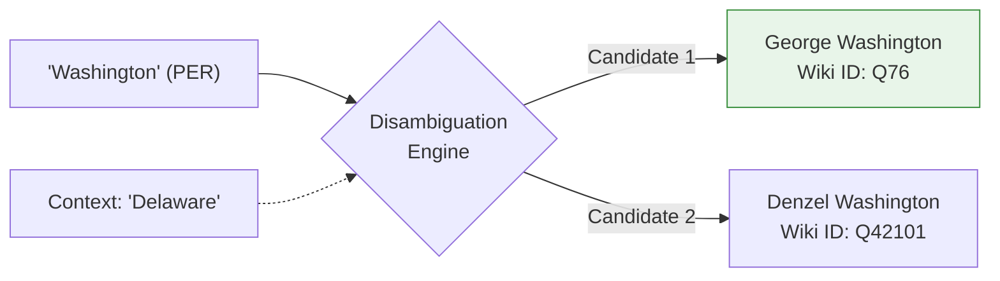

# Entity Linking

## 1. The Limitation of NER
Named Entity Recognition is only the first step in understanding text. NER tells the computer: *"The text span 'Washington' in this sentence is a PERSON."*

But *which* Washington? George Washington? Denzel Washington? Kerry Washington? The computer doesn't actually know. To the computer, 'Washington' is just an arbitrary string of characters tagged with the `PER` label. 

## 2. What is Entity Linking?
Entity Linking (also known as Named Entity Disambiguation or NED) is the task of mapping an ambiguous entity mention in text to a specific, unique identifier in a centralized Knowledge Base (like Wikipedia, Wikidata, or a private corporate database).

### The Entity Linking Pipeline
1. **Input**: "Washington crossed the Delaware." (NER identifies "Washington" as a `PER` entity).
2. **Knowledge Base Search**: The system searches Wikipedia for "Washington" and retrieves a list of candidate nodes (George, Denzel, etc.).
3. **Disambiguation**: The system evaluates the context of the sentence against the Knowledge Base. The word "Delaware" strongly mathematically correlates with the Wikipedia article for "George Washington".
4. **Output**: The system permanently links the string "Washington" to the unique URI: `https://en.wikipedia.org/wiki/George_Washington`.

---

## 3. Why It Matters
Entity linking turns raw text strings into a graph of connected, actionable knowledge. 

If an NLP pipeline processes thousands of news articles, Entity Linking allows the system to realize that mentions of *"The President"*, *"Barack Obama"*, and *"Obama"* across different documents all refer to the exact same underlying Knowledge Graph node. This is what powers modern Search Engines, allowing them to provide a single "Knowledge Panel" on the right side of the screen compiling facts about an entity regardless of how it was phrased in the text.

---

## 4. Exam Preparation

### How to Write This in an Exam

**5-Mark Question**: An NLP system reads the sentence: "Apple announced a new phone." The NER module correctly tags "Apple" as an ORG. What is the role of the Entity Linking module in the next step of the pipeline? Provide concrete examples of why it is necessary.
> **Answer**: The Entity Linking module will take the ambiguous text mention "Apple" (ORG) and attempt to map it to a specific, unique record in a definitive Knowledge Base (e.g., the Wikidata Q-identifier `Q312` for Apple Inc.). 
> This is strictly necessary because the string "Apple" tagged as an Organization is highly ambiguous. Without Entity Linking, the system does not know if the text refers to Apple Inc. (the tech company), Apple Corps (the Beatles' record label), or Apple Bank (the financial institution). By evaluating the context ("announced a new phone"), the linking module disambiguates the entity and maps it to the correct unique identifier.

---

### Can You Explain This?
- [ ] I can clearly define the difference between NER and Entity Linking.
- [ ] I can explain what a Knowledge Base (or Knowledge Graph) is in the context of NLP.
- [ ] I can explain why Entity Linking relies heavily on surrounding sentence context.
