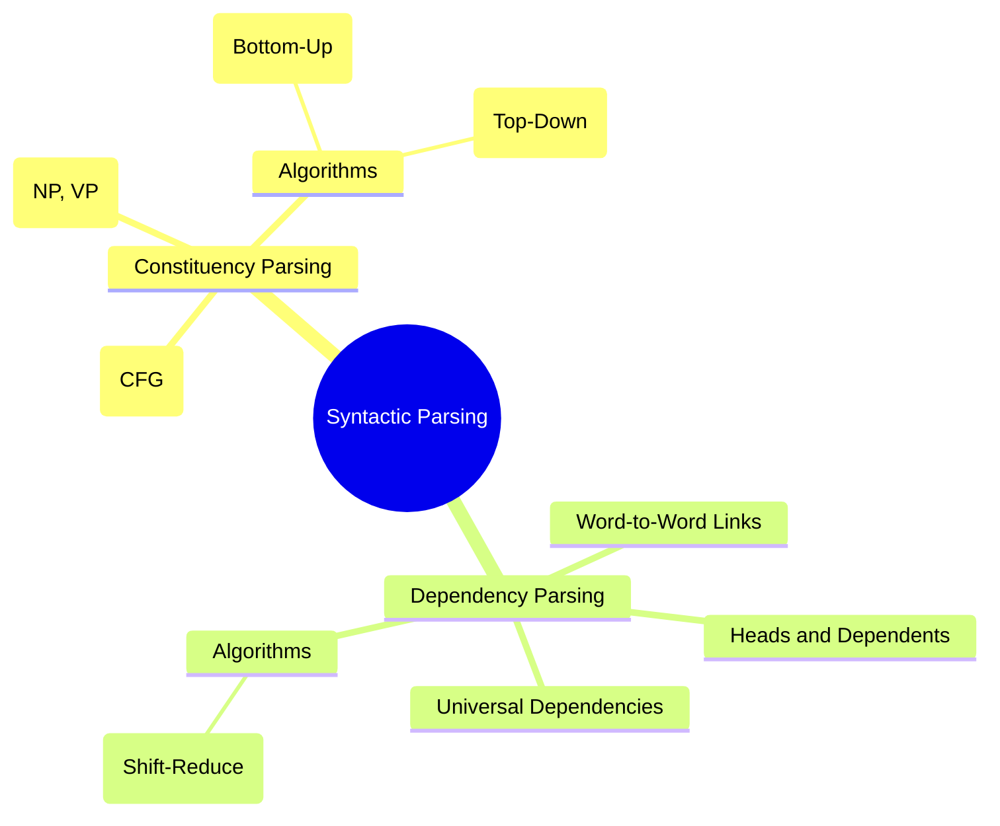

# 11. Parsing & Grammar

## 1. Topic Overview
This module explores syntactic parsing: the computational process of determining the grammatical structure of a sentence. It covers the two dominant paradigms in NLP: **Constituency Parsing** (grouping words into phrases using Context-Free Grammars) and **Dependency Parsing** (drawing direct relationships between head words and their dependents).

## 2. Learning Path
1. [Context-Free Grammars and Constituency Parsing](cfg-and-constituency.md)
2. [Parsing Algorithms](parsing-algorithms.md)
3. [Dependency Parsing](dependency-parsing.md)

## 3. Real-World Applications
- **Resolving Structural Ambiguity**: *"The cop shot the thief with the gun."* Did the cop use the gun to shoot? Or did the thief possess the gun? Without a parser to build the syntax tree and resolve this ambiguity, a computer cannot extract the correct semantic meaning from text.
- **Machine Translation**: Languages have different word orders (Subject-Verb-Object in English vs. Subject-Object-Verb in Japanese). A parser builds a language-agnostic structural tree of the English sentence, which can then be rearranged and translated into Japanese.
- **Grammar Checking**: Tools like Grammarly use parsers to determine if a sentence is structurally valid or if it is missing a critical component (like a Verb Phrase).

## 4. Difficulty & Importance
- **Mathematical Difficulty**: ★★☆☆☆ (Medium - Writing CFG rules requires strict logical formalism)
- **Implementation Difficulty**: ★★★☆☆ (Medium - We focus heavily on algorithmic theory rather than code implementation for CYK/Earley due to their massive complexity)
- **Exam Importance**: **Extremely High**. Every introductory NLP exam features a question where you are given a grammar and a sentence and must manually draw the resulting parse tree(s) to prove structural ambiguity.

## 5. Prerequisites
- [08. POS Tagging & Sequence Labeling](../08-pos-tagging-and-sequence-labeling/README.md) (POS tags act as the foundation for parsing)

## 6. External Resources
- 📘 **Textbook**: *Speech and Language Processing* (Jurafsky & Martin), Chapters 13 & 14.

---

### Can You Explain This?
- [ ] I can define Terminals and Non-Terminals in a CFG.
- [ ] I can draw a Constituency Parse Tree for a simple sentence.
- [ ] I can explain the fundamental difference between Constituency Parsing and Dependency Parsing.
- [ ] I understand why Dependency Parsing handles free-word-order languages (like Russian) better than Constituency Parsing.
