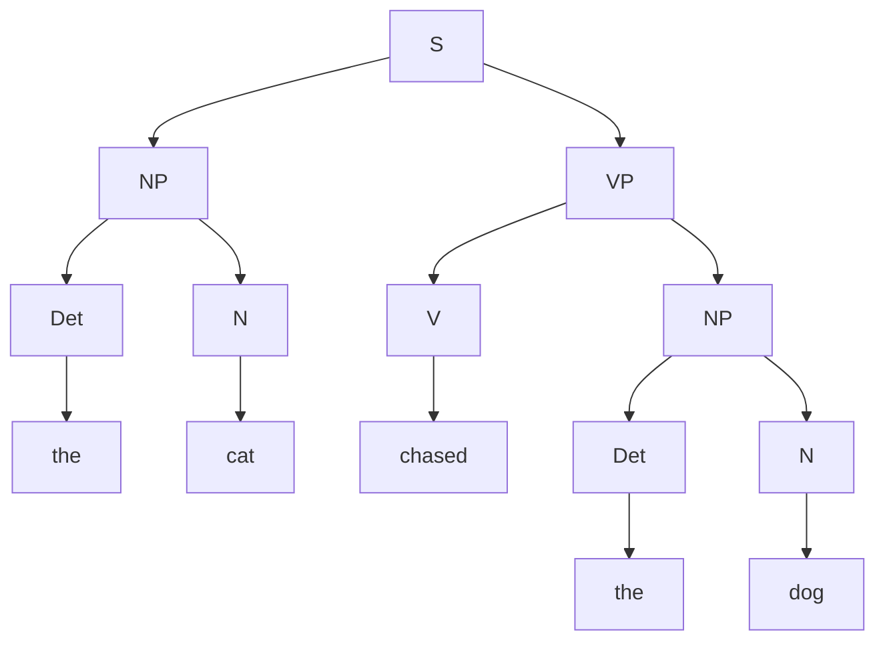

# Context-Free Grammars and Constituency Parsing

## 1. What is Parsing?
If POS tagging assigns a flat label to each word in a sequence, **Parsing** determines how those individual words group together to form a hierarchical structure. It answers the fundamental question: *"Which words modify which other words, and how do they combine to form a valid sentence?"*

There are two major paradigms of parsing in NLP: **Constituency Parsing** and **Dependency Parsing**. This document focuses exclusively on Constituency Parsing.

---

## 2. Context-Free Grammars (CFG)
To build a constituency parse tree, a computer must be provided with the explicit mathematical rules of the language. In computer science and NLP, we use a formal system called a **Context-Free Grammar (CFG)**, pioneered by linguist Noam Chomsky.

A CFG consists of four strict components:
1. **Terminals**: The actual, spoken words of the language (e.g., "the", "cat", "runs"). They are called terminals because they are the "leaves" at the end of the tree; they cannot be broken down further.
2. **Non-terminals**: Abstract grammatical categories and phrase markers (e.g., `NP` for Noun Phrase, `VP` for Verb Phrase, `Det` for Determiner).
3. **Start Symbol**: A special non-terminal that represents a complete, valid sentence, universally denoted as `S`.
4. **Production Rules**: Mathematical rules dictating exactly how non-terminals can be expanded. 
   - Format: `A -> B C` (Meaning: Non-terminal A can be expanded into B followed by C).

### Example English CFG
```text
# Phrase Structure Rules
S  -> NP VP      (A sentence is a Noun Phrase followed by a Verb Phrase)
NP -> Det N      (A Noun Phrase is a Determiner followed by a Noun)
VP -> V NP       (A Verb Phrase is a Verb followed by a Noun Phrase)

# Lexicon (Terminals)
Det -> "the" | "a"
N  -> "cat" | "dog"
V  -> "chased" | "saw"
```

---

## 3. Derivations
A **derivation** is the formal sequence of rule applications that transforms the start symbol `S` into a final string of terminal words.

### Leftmost Derivation
In a leftmost derivation, you must always expand the leftmost non-terminal available in the string. Let's derive "the cat chased the dog":

1. `S`
2. `NP VP` *(Expanded S)*
3. `Det N VP` *(Expanded the leftmost NP)*
4. `"the" N VP` *(Expanded Det)*
5. `"the" "cat" VP` *(Expanded N)*
6. `"the" "cat" V NP` *(Expanded VP)*
7. `"the" "cat" "chased" NP` *(Expanded V)*
8. `"the" "cat" "chased" Det N` *(Expanded NP)*
9. `"the" "cat" "chased" "the" N` *(Expanded Det)*
10. `"the" "cat" "chased" "the" "dog"` *(Expanded N - Final!)*

*(Note: Rightmost derivation is the exact opposite—expanding the rightmost non-terminal first. Both derivations will always result in the exact same final parse tree).*

---

## 4. Parse Trees and Bracketing

The mathematical derivation above can be visually represented as a **Constituency Parse Tree**. 



### Bracketing
In massive NLP datasets (like the Penn Treebank), drawing visual trees is impossible. Instead, we represent the exact same hierarchical structure using nested brackets (similar to LISP programming):
`[S [NP [Det the] [N cat]] [VP [V chased] [NP [Det the] [N dog]]]]`

---

## 5. Structural Ambiguity
A sentence is defined as **structurally ambiguous** if a single CFG can generate *more than one valid parse tree* for that exact same sentence. 

> [!WARNING]
> This is the single biggest problem in Constituency Parsing. If a sentence has two valid trees, the computer cannot know which one represents the true semantic meaning.

### The Classic Example
> *"I shot an elephant in my pajamas."* (Groucho Marx)

Does the Prepositional Phrase ("in my pajamas") modify the **elephant** (the elephant was wearing pajamas), or does it modify the **shooting** (I was wearing pajamas while shooting)?

- **Parse 1 (Modifying the Verb)**: `[S [NP I] [VP [VP shot [NP an elephant]] [PP in my pajamas]]]`
- **Parse 2 (Modifying the Noun)**: `[S [NP I] [VP shot [NP [NP an elephant] [PP in my pajamas]]]]`

Resolving this ambiguity requires **semantic/world knowledge**, which pure mathematical CFGs lack entirely. This failure led to the development of **Probabilistic CFGs (PCFGs)**, which assign probabilities to grammar rules based on how frequently they actually occur in real human language.

---

## 6. Exam Preparation

### How to Write This in an Exam

**5-Mark Question**: Define structural ambiguity in the context of Context-Free Grammars (CFGs). Provide a classic example sentence and explain the two possible interpretations.
> **Answer**: Structural ambiguity occurs when a single sentence can be parsed into two or more distinct, mathematically valid constituency trees using the same CFG. 
> 
> Example: *"I saw the man with the telescope."*
> - **Interpretation 1 (Verb Attachment)**: The prepositional phrase "with the telescope" modifies the verb "saw". (Meaning: I used a telescope as an instrument to see the man).
> - **Interpretation 2 (Noun Attachment)**: The prepositional phrase modifies the noun "man". (Meaning: I saw a man who was holding a telescope).
> 
> Because both structures are grammatically legal under standard English CFG rules, the parser cannot determine the correct semantic meaning without external probabilistic or semantic data.

**4-Mark Question**: Write a simple CFG that can generate the exact sentence *"The fast dog barks"*.
> **Answer**:
> ```text
> S -> NP VP
> NP -> Det Adj N
> VP -> V
> Det -> "The"
> Adj -> "fast"
> N -> "dog"
> V -> "barks"
> ```

---

### Can You Explain This?
- [ ] I can list the four mathematical components of a Context-Free Grammar.
- [ ] I understand the difference between a Terminal and a Non-Terminal.
- [ ] I can convert a nested bracket representation into a drawn parse tree.
- [ ] I can explain why Probabilistic CFGs (PCFGs) were invented.
