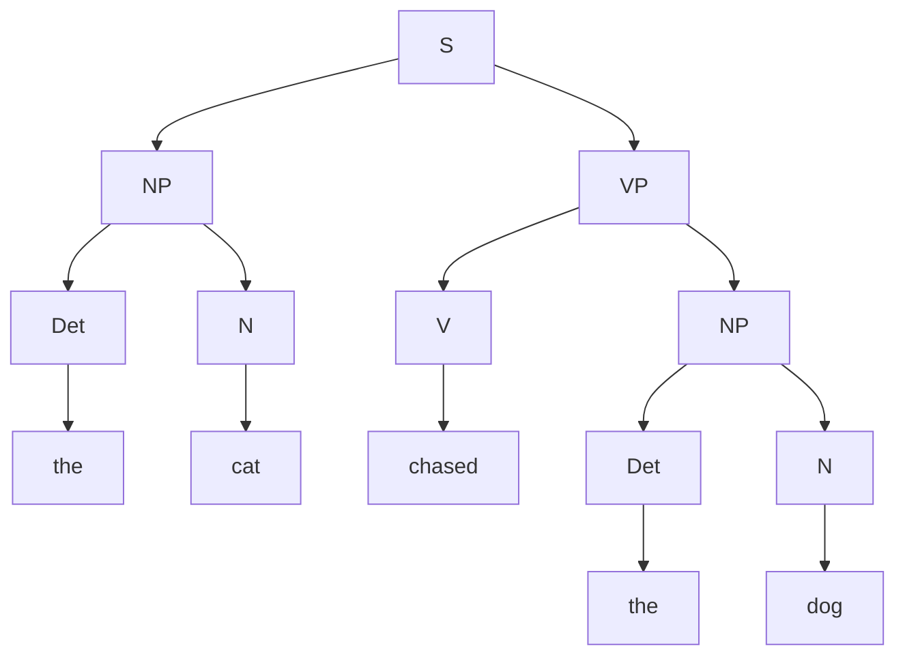

# Context-Free Grammars and Constituency Parsing

## 1. What is Parsing?
If POS tagging assigns a label to each word, **Parsing** determines how those words group together to form a hierarchical structure. It answers the question: "Which words modify which other words, and how do they form a valid sentence?"

There are two major paradigms of parsing in NLP: **Constituency Parsing** and **Dependency Parsing**. This document focuses on Constituency Parsing.

## 2. Context-Free Grammars (CFG)
To build a constituency parse tree, we must define the rules of the language. In computer science and NLP, we use a formal system called a Context-Free Grammar (CFG), developed by Noam Chomsky.

A CFG consists of four components:
1. **Terminals**: The actual words of the language (e.g., "the", "cat", "runs"). They are called terminals because they are the end of the tree; they cannot be broken down further.
2. **Non-terminals**: Abstract grammatical categories (e.g., `NP` for Noun Phrase, `VP` for Verb Phrase, `Det` for Determiner).
3. **Start Symbol**: A special non-terminal that represents a complete sentence, usually denoted as `S`.
4. **Production Rules**: Rules dictating how non-terminals can be expanded. 
   - Format: `A -> B C` (Non-terminal A expands into B and C).

### Example English CFG
```text
S  -> NP VP      (A sentence is a Noun Phrase followed by a Verb Phrase)
NP -> Det N      (A Noun Phrase is a Determiner followed by a Noun)
VP -> V NP       (A Verb Phrase is a Verb followed by a Noun Phrase)
Det -> "the" | "a"
N  -> "cat" | "dog"
V  -> "chased" | "saw"
```

## 3. Derivations
A **derivation** is the sequence of rule applications that transforms the start symbol `S` into a string of terminal words.

### Leftmost Derivation
Always expand the leftmost non-terminal first.
1. `S`
2. `NP VP` (Expanded S)
3. `Det N VP` (Expanded NP)
4. `"the" N VP` (Expanded Det)
5. `"the" "cat" VP` (Expanded N)
6. `"the" "cat" V NP` (Expanded VP)
7. `"the" "cat" "chased" NP` (Expanded V)
8. `"the" "cat" "chased" Det N` (Expanded NP)
9. `"the" "cat" "chased" "the" N` (Expanded Det)
10. `"the" "cat" "chased" "the" "dog"` (Expanded N - Final!)

*Rightmost derivation* is the exact opposite: expanding the rightmost non-terminal first. Both result in the same final tree.

## 4. Parse Trees and Bracketing
The derivation above can be visually represented as a **Constituency Parse Tree**. 



### Bracketing
Instead of drawing a tree, we can represent the exact same hierarchical structure using nested brackets (often used in LISP or the Penn Treebank dataset):
`[S [NP [Det the] [N cat]] [VP [V chased] [NP [Det the] [N dog]]]]`

## 5. Structural Ambiguity
A sentence is **structurally ambiguous** if a single CFG can generate *more than one valid parse tree* for that sentence.

### The Classic Example
> *"I shot an elephant in my pajamas."*

Does "in my pajamas" modify the **elephant** (the elephant was wearing pajamas), or does it modify the **shooting** (I was wearing pajamas while shooting)?

- **Parse 1 (Modifying the Verb)**: `[S [NP I] [VP [VP shot [NP an elephant]] [PP in my pajamas]]]`
- **Parse 2 (Modifying the Noun)**: `[S [NP I] [VP shot [NP [NP an elephant] [PP in my pajamas]]]]`

Resolving this requires **semantic** knowledge, which pure CFGs lack. This led to the development of Probabilistic CFGs (PCFGs) which assign probabilities to rules based on how frequently they occur in real language.

## 6. Exam Preparation
### Must Memorize
- Terminals are words. Non-terminals are POS tags and phrase markers (NP, VP).
- A grammar is ambiguous if one string has $\ge 2$ valid leftmost derivations (which results in $\ge 2$ valid trees).

### Likely Practical Question
**Question**: Write a CFG that can generate the sentence "The fast dog barks".
**Answer**:
```text
S -> NP VP
NP -> Det Adj N
VP -> V
Det -> "The"
Adj -> "fast"
N -> "dog"
V -> "barks"
```
