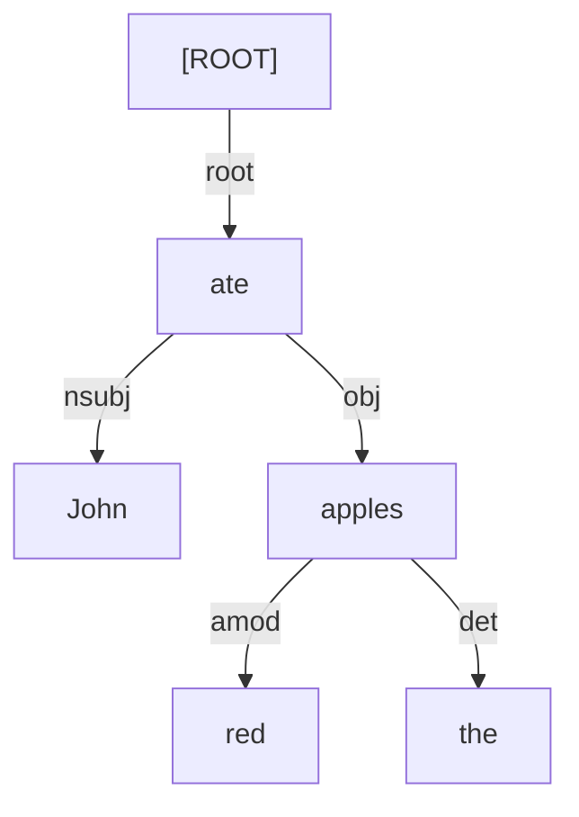

# Dependency Parsing

## 1. What is Dependency Parsing?
In Constituency Parsing (CFGs), words are grouped into abstract phrases (like `NP` and `VP`).
In **Dependency Parsing**, there are no abstract phrases. Instead, the structure is represented by direct, directed links (dependencies) between the words themselves.

## 2. Head and Dependent
Every dependency relation connects two words:
1. **Head (Governor)**: The core word that dictates the grammar.
2. **Dependent (Modifier)**: The word that modifies or depends on the head.

*Example*: "Fast car." 
- `car` is the Head.
- `fast` is the Dependent (it modifies 'car').

*Example*: "John ate."
- `ate` is the Head.
- `John` is the Dependent (the subject doing the eating).

## 3. The Root Node
Every dependency tree must have a single artificial `ROOT` node. This node points to the main verb (the structural center) of the sentence. This guarantees that every actual word in the sentence is a Dependent of exactly one other node.

## 4. Dependency Relations (Labels)
The arrows connecting words are usually labeled with the specific grammatical relationship. Universal Dependencies (UD) is the standard tagset.
- `nsubj`: Nominal subject ("**John** ate")
- `obj`: Direct object ("ate **apples**")
- `amod`: Adjectival modifier ("**red** apple")
- `det`: Determiner ("**the** apple")
- `root`: The link from the artificial ROOT node to the main verb.

## 5. Visualizing Dependencies

## 6. CoNLL-U Format
Because drawing graphs is hard for computers, dependency parses are universally stored in the CoNLL-U text format. It is a tab-separated table where each row is a word.

| ID | Word | Lemma | POS | ... | Head ID | DepRel |
|---|---|---|---|---|---|---|
| 1 | John | John | PROPN | ... | 2 | nsubj |
| 2 | ate | eat | VERB | ... | 0 | root |
| 3 | the | the | DET | ... | 5 | det |
| 4 | red | red | ADJ | ... | 5 | amod |
| 5 | apples | apple | NOUN | ... | 2 | obj |

*Notice how word 1 (John) points to Head ID 2 (ate). Word 2 (ate) points to Head ID 0 (the artificial root).*

## 7. Why Dependency over Constituency?
Dependency parsing is far more popular in modern NLP than constituency parsing because:
1. **Free Word Order**: In languages like Russian or Latin, words can be moved around freely without changing the meaning. CFGs break down when word order isn't strict. Dependency parsing doesn't care about word order, only relationships.
2. **Feature Extraction**: If you want to know "Who did the eating?", you just look for the `nsubj` arrow pointing to "ate". In a CFG, you have to write complex tree-search algorithms to find the Subject NP.

## 8. Exam Preparation
### Must Memorize
- Dependency parsing connects words to words. Constituency parsing connects words to abstract phrase markers.
- Every word has exactly one head, except the `ROOT`.

### Likely Practical Question
**Question**: Convert the sentence "The small cat slept" into a CoNLL-style table showing ID, Word, Head ID, and Dependency Relation.
**Answer**:
1. The $\rightarrow$ Head: 3 (cat), Rel: `det`
2. small $\rightarrow$ Head: 3 (cat), Rel: `amod`
3. cat $\rightarrow$ Head: 4 (slept), Rel: `nsubj`
4. slept $\rightarrow$ Head: 0 (ROOT), Rel: `root`
