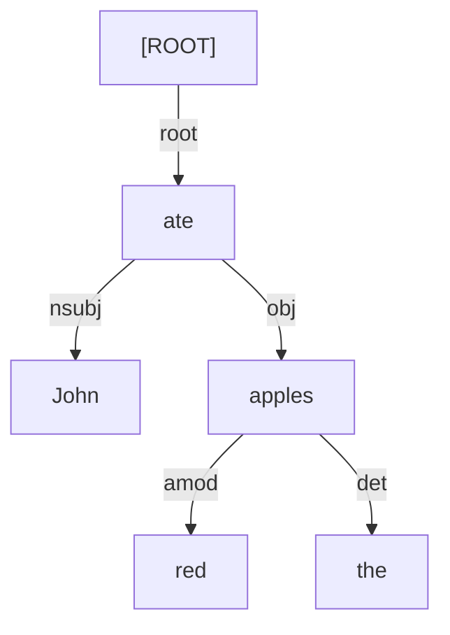

# Dependency Parsing

## 1. What is Dependency Parsing?
In Constituency Parsing (CFGs), words are grouped into abstract theoretical phrases (like `NP` and `VP`).
In **Dependency Parsing**, there are absolutely no abstract phrases. Instead, the grammatical structure is represented by direct, directed links (dependencies) drawn straight between the words themselves.

## 2. Head and Dependent
Every mathematical dependency relation connects exactly two words:
1. **Head (Governor)**: The core word that dictates the grammar.
2. **Dependent (Modifier)**: The word that modifies, describes, or structurally depends on the head.

*Example*: "Fast car." 
- `car` is the **Head**.
- `fast` is the **Dependent** (it modifies 'car').

*Example*: "John ate."
- `ate` is the **Head** (verbs usually govern sentences).
- `John` is the **Dependent** (the subject doing the eating).

## 3. The Root Node
To make the math work, every dependency tree must have a single artificial `[ROOT]` node added to it. This invisible node points to the main verb (the structural center) of the sentence. 

> [!IMPORTANT]
> **The Golden Rule of Dependency Graphs**
> Every actual word in the sentence must be a Dependent of exactly one other node (it must have exactly one incoming arrow). A word can be the Head for many words, but it can only have one Head itself.

---

## 4. Dependency Relations (Labels)
The arrows connecting words are usually labeled with their specific grammatical relationship. The **Universal Dependencies (UD)** framework is the global standard tagset used across dozens of languages.

| UD Label | Meaning | Example |
| :--- | :--- | :--- |
| `nsubj` | Nominal subject | "**John** ate" |
| `obj` | Direct object | "ate **apples**" |
| `amod` | Adjectival modifier | "**red** apple" |
| `det` | Determiner | "**the** apple" |
| `root` | Root link | `[ROOT]` $\rightarrow$ "**ate**" |

### Visualizing Dependencies

---

## 5. The CoNLL-U Format
Because drawing graph visualizations is impossible for a computer to read, dependency parses are universally stored and shared in the **CoNLL-U text format**. 

It is a strict, tab-separated table where each row represents exactly one word token.

| ID | Word | Lemma | POS | ... | Head ID | DepRel (Label) |
| :--- | :--- | :--- | :--- | :--- | :--- | :--- |
| 1 | John | John | PROPN | ... | **2** | `nsubj` |
| 2 | ate | eat | VERB | ... | **0** | `root` |
| 3 | the | the | DET | ... | **5** | `det` |
| 4 | red | red | ADJ | ... | **5** | `amod` |
| 5 | apples | apple | NOUN | ... | **2** | `obj` |

*Notice the math here: Word ID 1 (John) explicitly points to Head ID 2 (ate). Word ID 2 (ate) points to Head ID 0 (the artificial root, which always has ID 0).*

---

## 6. Why Dependency over Constituency?
Dependency parsing has largely overtaken constituency parsing in modern NLP for two major reasons:

1. **Free Word Order Languages**: In English, word order is strict (Subject-Verb-Object). In languages like Russian, Latin, or Finnish, words can be moved around freely in the sentence without changing the core meaning. CFGs break down completely when word order isn't strict (you'd have to write hundreds of rules). Dependency parsing doesn't care about word order at all; the arrow from "John" to "ate" exists no matter where the words are placed.
2. **Feature Extraction**: If an Information Extraction system wants to know *"Who did the eating?"*, it simply looks for the `nsubj` arrow pointing to the word "ate". In a CFG, the system would have to write complex, recursive tree-search algorithms to traverse up to the `S` node and down to the `NP` to find the Subject.

---

## 7. Exam Preparation

### How to Write This in an Exam

**5-Mark Question**: Convert the sentence *"The small cat slept"* into a standard CoNLL-style table. Show the ID, Word, Head ID, and Dependency Relation.
> **Answer**:
> | ID | Word | Head ID | Relation |
> | :--- | :--- | :--- | :--- |
> | 1 | The | 3 | `det` |
> | 2 | small | 3 | `amod` |
> | 3 | cat | 4 | `nsubj` |
> | 4 | slept | 0 | `root` |

**3-Mark Question**: Why is Dependency Parsing generally preferred over Constituency Parsing when dealing with morphologically rich, free-word-order languages like Russian?
> **Answer**: Constituency Parsing relies on Context-Free Grammars (CFGs), which define structure based on strict, adjacent word order (e.g., `S -> NP VP`). In a free-word-order language, the subject, verb, and object can appear in almost any sequence, meaning a CFG would require an unmanageable explosion of rules to cover every permutation. Dependency Parsing defines structure via direct, word-to-word links that ignore physical sentence position, making it highly robust to word reordering.

---

### Can You Explain This?
- [ ] I can define the terms "Head" and "Dependent".
- [ ] I can explain the Golden Rule of Dependency Graphs regarding incoming arrows.
- [ ] I can read a CoNLL-U table and draw the resulting dependency tree.
