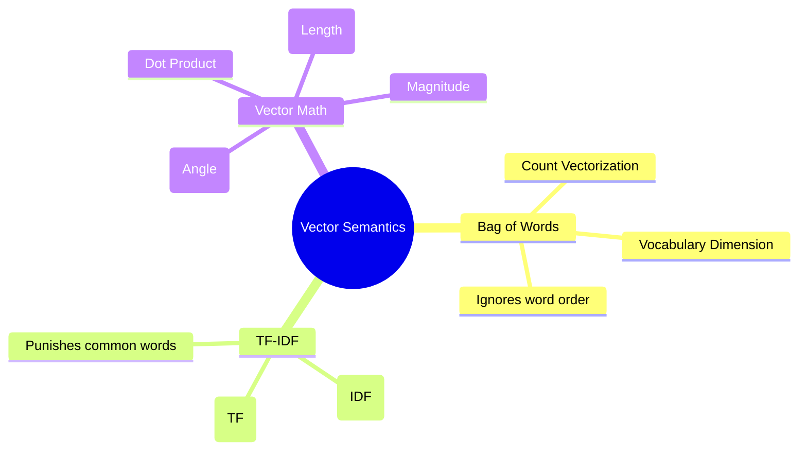

# 12. TF-IDF & Vector Semantics

## 1. Topic Overview
This module introduces the critical mathematical foundation of converting raw text strings into numerical vectors (Vectorization) so that machine learning algorithms can process them. It covers the progression from simple Bag of Words, to frequency-weighted TF-IDF, and finally measuring document similarity using Vector Mathematics.

## 2. Learning Path
1. [Bag of Words & Count Vectors](bag-of-words.md)
2. [Term Frequency-Inverse Document Frequency (TF-IDF)](tf-idf.md)
3. [Cosine Similarity & Vector Mathematics](cosine-similarity.md)

## 3. Real-World Applications
- **Classic Search Engines**: Every major search engine in the late 1990s and early 2000s ran on TF-IDF and Cosine Similarity. When you type a query, the engine converts your query into a TF-IDF vector, calculates the Cosine Similarity against millions of document vectors in its database, and returns the documents with the highest similarity score.
- **Plagiarism Detection**: By converting two student essays into vectors, you can calculate the angle between them. If the angle is 0 (Cosine Similarity of 1), the documents use the exact same vocabulary frequencies, heavily implying plagiarism.

## 4. Difficulty & Importance
- **Mathematical Difficulty**: ★★★☆☆ (Medium - Requires calculating logarithms, dot products, vector magnitudes, and square roots)
- **Implementation Difficulty**: ★☆☆☆☆ (Very Low - Basic mathematical operations in Python)
- **Exam Importance**: **Extremely High**. Calculating TF-IDF values and Cosine Similarity by hand are absolute staple questions on any NLP or Information Retrieval exam. Expect heavy numerical problems.

## 5. Prerequisites
- Basic Algebra.
- [03. Tokenization](../03-tokenization/README.md) (Understanding how text is split into the terms that make up the vocabulary).

## 6. External Resources
- 📘 **Textbook**: *Speech and Language Processing* (Jurafsky & Martin), Chapter 6.

---

### Can You Explain This?
- [ ] I can explain what dimension a Bag of Words vector lives in.
- [ ] I can explain what specific problem TF-IDF solves that Count Vectorization cannot.
- [ ] I can explain why "the" receives an IDF score of $0$.
- [ ] I can explain why Cosine Similarity is heavily preferred over Euclidean Distance for document comparison.
