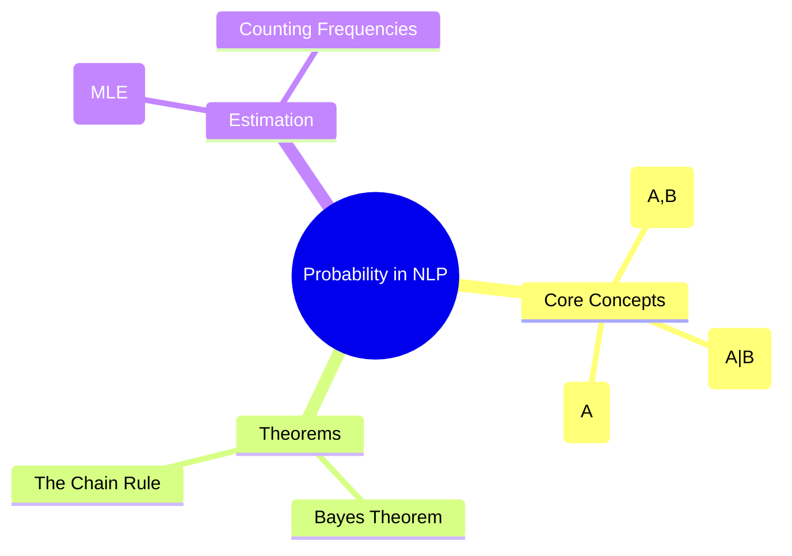

# 13. Probability Foundations

## 1. Topic Overview
This module provides a brief but critical review of the core mathematical statistics required to understand how Language Models (like N-Grams and modern LLMs) predict text, and how classifiers (like Naive Bayes) categorize text.

## 2. Learning Path
1. [Probability Basics](probability-basics.md)
2. [Bayes Theorem and The Chain Rule](bayes-and-chain-rule.md)
3. [Maximum Likelihood Estimation (MLE)](maximum-likelihood-estimation.md)

## 3. Real-World Applications
- **Autocompletion & Generative AI**: Every time you use an autocomplete feature on your phone or ask ChatGPT a question, the underlying model is doing exactly one thing: calculating the mathematical *Conditional Probability* of the next word given the sequence of previous words, heavily relying on the Chain Rule of Probability.
- **Spam Filtering**: Email systems use Bayes' Theorem to calculate the probability that an email is `SPAM` given the presence of words like "Free" and "Winner" in the text.

## 4. Difficulty & Importance
- **Mathematical Difficulty**: ★★★☆☆ (Medium - Requires understanding formal probability notation and fractions)
- **Implementation Difficulty**: ★☆☆☆☆ (Very Low - Calculating counts from text is just simple division in Python)
- **Exam Importance**: **Medium-High**. The concepts here are fundamental prerequisites for N-gram Language Models and Naive Bayes classifiers. Calculating conditional probabilities from a tiny toy corpus is a guaranteed exam question.

## 5. Prerequisites
- Basic Algebra (Fractions and division).

## 6. External Resources
- 📘 **Textbook**: *Speech and Language Processing* (Jurafsky & Martin), Chapter 3.

---

### Can You Explain This?
- [ ] I can clearly explain the difference between Joint Probability $P(A,B)$ and Conditional Probability $P(A|B)$.
- [ ] I can write the formula for Bayes' Theorem.
- [ ] I can write out the Chain Rule expansion for the sequence $P(w_1, w_2, w_3)$.
- [ ] I can explain what Maximum Likelihood Estimation (MLE) is in the context of counting words in a text corpus.
