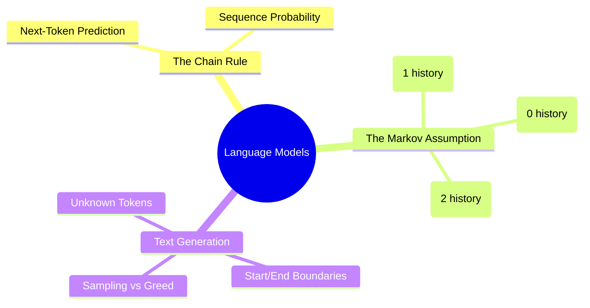

# 14. N-gram Language Models

## 1. Topic Overview
This module introduces the classical approach to Language Modeling: predicting the mathematical probability of entire text sequences using N-grams and the Markov Assumption.

## 2. Learning Path
1. [Language Models and N-grams](language-models-and-ngrams.md)
2. [N-gram Probabilities](n-gram-probabilities.md)
3. [Text Generation and Boundaries](text-generation.md)

## 3. Real-World Applications
- **Predictive Typing & Autocomplete**: When your smartphone keyboard suggests the next word, it is using a Language Model to calculate the highest probability next-token.
- **Speech Recognition**: Acoustic models often confuse similar sounding words (like "recognize speech" vs "wreck a nice beach"). A Language Model is used to determine that "recognize speech" has a vastly higher statistical probability of being said in English, correcting the transcription.
- **Generative AI (Modern LLMs)**: Every modern Large Language Model (like GPT-4) is fundamentally doing the exact same mathematical task described in this module: Next-Token Prediction via the Chain Rule of Probability. While modern models use neural networks instead of MLE counting tables, the framing of the task—calculating $P(w_n \mid w_1...w_{n-1})$—remains functionally identical.

## 4. Difficulty & Importance
- **Mathematical Difficulty**: ★★★☆☆ (Medium - Requires carefully tracking counts, numerators, and denominators without making careless arithmetic errors)
- **Implementation Difficulty**: ★★★☆☆ (Medium - Writing the nested dictionaries for the Python bigram generator takes practice)
- **Exam Importance**: **Extremely High**. "Given this 3-sentence toy corpus, what is the exact probability of the sentence X under a Bigram model?" is an absolute guarantee on any NLP exam. This is the core of statistical NLP.

## 5. Prerequisites
- [13. Probability Foundations](../13-probability-foundations/README.md) (Crucial: The Chain Rule and MLE)
- [03. Tokenization](../03-tokenization/README.md)

## 6. External Resources
- 📘 **Textbook**: *Speech and Language Processing* (Jurafsky & Martin), Chapter 3.1 & 3.2.

---

### Can You Explain This?
- [ ] I can formally define what a Language Model is mathematically trying to compute.
- [ ] I can explain what the Markov Assumption is and why we are forced to use it.
- [ ] I can explain why a Bigram model only looks at 1 previous word, not 2.
- [ ] I can calculate the probability of a full sentence using Bigram probabilities and boundary tags.
