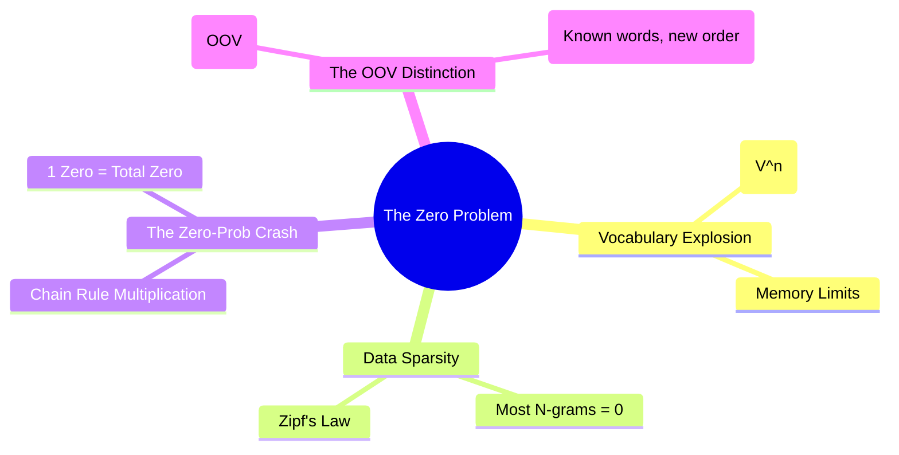

# 15. Sparsity & Zero-Probability Problem

## 1. Topic Overview
This module explores the fatal mathematical limitations of pure N-gram Language Models and explains why simple Maximum Likelihood Estimation (MLE) fails catastrophically when deployed in the real world. 

## 2. Learning Path
1. [Data Sparsity and Vocabulary Explosion](data-sparsity.md)
2. [The Zero-Probability Problem](the-zero-probability-problem.md)

## 3. Real-World Applications
- **Why Smoothers Exist**: You can train an N-gram model on the entire text of the internet, and it will *still* encounter perfectly valid, grammatically correct English phrases that it has never seen before on a daily basis. Understanding data sparsity is the key to understanding why Smoothing algorithms (like Laplace or Kneser-Ney) were invented.
- **Why Neural Networks Took Over**: Modern Deep Learning (Word Embeddings and Transformers) largely replaced N-gram models specifically because neural networks map words to dense mathematical vectors, completely eliminating the sparse matrix problem discussed in this module.

## 4. Difficulty & Importance
- **Mathematical Difficulty**: ★☆☆☆☆ (Very Low - Purely conceptual)
- **Implementation Difficulty**: ★☆☆☆☆ (Very Low)
- **Exam Importance**: **Medium-High**. The conceptual distinction between *Out-of-Vocabulary (OOV) Words* and *Unseen N-grams* is a classic trick question on midterm exams. This module provides the critical theoretical justification for the numerical problems you will face in the next module (Smoothing).

## 5. Prerequisites
- [14. N-gram Language Models](../14-n-gram-language-models/README.md) (Crucial: The Chain Rule multiplication)

## 6. External Resources
- 📘 **Textbook**: *Speech and Language Processing* (Jurafsky & Martin), Chapter 3.

---

### Can You Explain This?
- [ ] I can explain why the number of possible N-grams grows exponentially.
- [ ] I can explain what Data Sparsity means in the context of an N-gram count matrix.
- [ ] I can explain exactly why a single unseen bigram causes an entire sentence's probability to become exactly $0.0$.
- [ ] I can clearly explain the difference between an Unknown Word and an Unseen N-gram.
