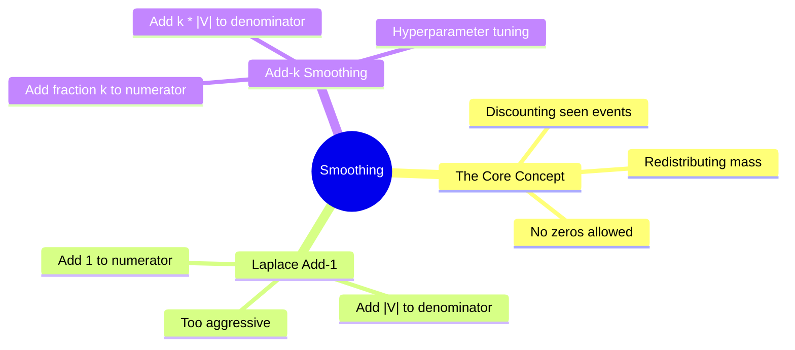

# 16. Laplace & Add-k Smoothing

## 1. Topic Overview
This module introduces the mathematical algorithms used to solve the "Zero-Probability Problem" in classical NLP. It explains how to mathematically shift probability mass from sequences the model has seen, and legally redistribute it to sequences the model has not seen, ensuring the Chain Rule never collapses.

## 2. Learning Path
1. [Laplace Smoothing (Add-One)](laplace-smoothing.md)
2. [Add-k Smoothing](add-k-smoothing.md)

## 3. Real-World Applications
- **Predictive Text Robustness**: Without smoothing, any classical autocomplete system or N-gram generator is completely unusable in the real world because it will physically crash or return a probability of 0.0 the moment a user types a valid, novel combination of words.
- **Naive Bayes Spam Filters**: The famous Naive Bayes text classification algorithm mathematically relies on the exact same Laplace Smoothing formulas taught in this module to prevent the presence of a single unseen word from instantly clearing an email of being classified as Spam.

## 4. Difficulty & Importance
- **Mathematical Difficulty**: ★★★☆☆ (Medium - The formulas are simple, but students constantly forget to add the Vocabulary size $|V|$ to the denominator)
- **Implementation Difficulty**: ★☆☆☆☆ (Very Low - The formulas are one-liners in code)
- **Exam Importance**: **Extremely High**. Calculating smoothed probabilities by hand using Laplace or Add-k formulas is one of the most common numerical questions on NLP exams. 

## 5. Prerequisites
- [14. N-gram Language Models](../14-n-gram-language-models/README.md)
- [15. Sparsity & Zero-Probability Problem](../15-sparsity-and-zero-probability-problem/README.md)

## 6. External Resources
- 📘 **Textbook**: *Speech and Language Processing* (Jurafsky & Martin), Chapter 3.4.

---

### Can You Explain This?
- [ ] I can write the Laplace Smoothing formula for a Bigram model.
- [ ] I can explain mathematically why we must add the Vocabulary size $|V|$ to the denominator.
- [ ] I can explain why Laplace smoothing is considered "too aggressive" for large datasets.
- [ ] I understand the difference between Laplace and Add-k smoothing.
