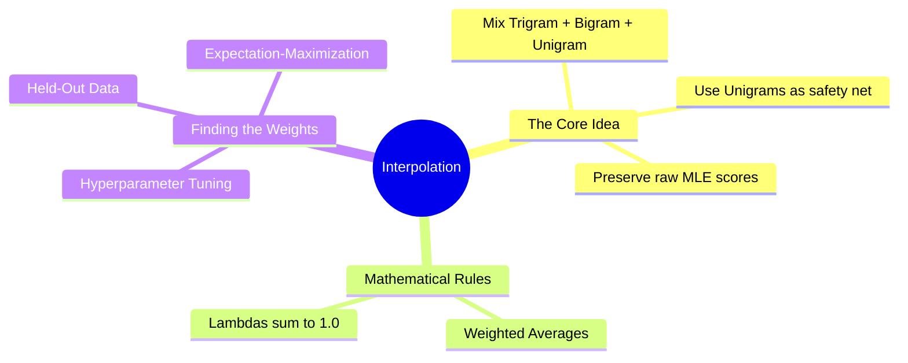

# 17. Interpolation

## 1. Topic Overview
This module covers **Linear Interpolation**, a significantly more advanced and elegant smoothing technique than Laplace Add-k. It solves the zero-probability problem by mathematically combining (interpolating) multiple different N-gram models together to create a single, highly robust language model.

## 2. Learning Path
1. [Linear Interpolation](linear-interpolation.md)
2. [Estimating Interpolation Weights](estimating-weights.md)

## 3. Real-World Applications
- **Acoustic Speech Recognition (ASR)**: Voice dictation software heavily utilizes interpolated language models. If a user dictates a highly novel 3-word phrase that the Trigram model has never seen (yielding 0.0), the system doesn't crash. Instead, it smoothly relies on the Bigram and Unigram models, which *have* seen the individual words, preventing transcription failure.
- **Ensemble Machine Learning**: The mathematical concept of combining multiple weak/independent models together via a weighted average to create one strong "Ensemble" model is used everywhere in modern ML, from Random Forests to Neural Network dropout.

## 4. Difficulty & Importance
- **Mathematical Difficulty**: ★★☆☆☆ (Low - The formula is just a basic weighted average)
- **Implementation Difficulty**: ★☆☆☆☆ (Very Low - The interpolation equation is highly straightforward in Python)
- **Exam Importance**: **Medium-High**. Calculating the final interpolated probability given three raw MLE tables and three $\lambda$ (Lambda) weights is a highly common numerical exam question.

## 5. Prerequisites
- [14. N-gram Language Models](../14-n-gram-language-models/README.md) (Crucial: How Trigrams, Bigrams, and Unigrams work mathematically).
- [15. Sparsity & Zero-Probability Problem](../15-sparsity-and-zero-probability-problem/README.md) (Crucial: Understanding why Trigrams fail so often).

## 6. External Resources
- 📘 **Textbook**: *Speech and Language Processing* (Jurafsky & Martin), Chapter 3.

---

### Can You Explain This?
- [ ] I can write out the full Linear Interpolation formula combining a Trigram, Bigram, and Unigram model.
- [ ] I can explicitly state the strict mathematical rule that all $\lambda$ weights must follow.
- [ ] I can conceptualize the difference between "Interpolating" models and "Backing Off" to lower models.
- [ ] I can explain why Held-Out data is strictly necessary to estimate the $\lambda$ weights.
