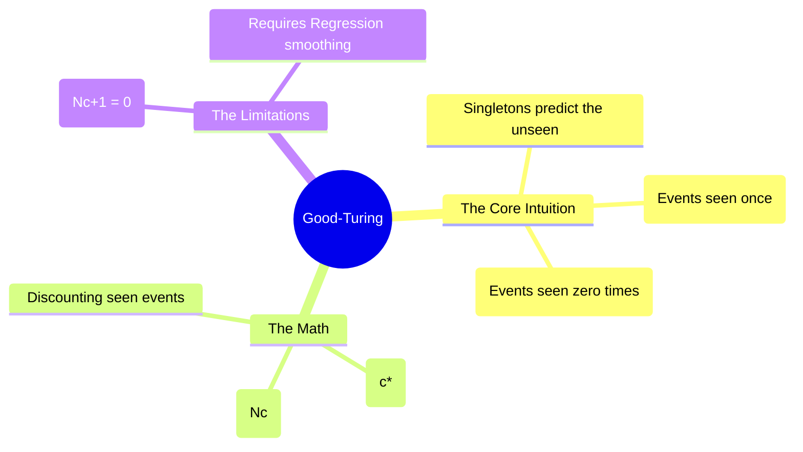

# 18. Good-Turing Smoothing

## 1. Topic Overview
This module introduces **Good-Turing Smoothing**, a highly advanced, historically significant discounting algorithm that approaches the Zero-Probability problem from an entirely different mathematical perspective. Rather than blindly adding $1$ or $k$ to every unseen event, it estimates the probability of unseen events by analyzing the frequency of singletons (events that the model only saw exactly once).

## 2. Learning Path
1. [Good-Turing Fundamentals](good-turing-fundamentals.md)
2. [Good-Turing Regression](good-turing-regression.md)

## 3. Real-World Applications
- **Ecological Species Discovery**: The core math behind Good-Turing was actually invented by Alan Turing during WWII to crack the Enigma code, but it was later heavily adapted by ecologists. If you spend a week in the jungle and see 50 species of birds, but 10 of those species you only saw exactly once (singletons), you can use the Good-Turing formula to accurately estimate how many completely unseen species are still hiding in the jungle.
- **Katz Backoff**: Good-Turing discounting is the mathematical engine that powers the famous Katz Backoff language model (covered in Module 20).

## 4. Difficulty & Importance
- **Mathematical Difficulty**: ★★★★☆ (High - Calculating the adjusted counts requires careful tracking of $N_c$ table variables, and understanding the regression fix requires basic statistics knowledge).
- **Implementation Difficulty**: ★★★☆☆ (Medium - Requires building specific histogram arrays in Python).
- **Exam Importance**: **High**. Calculating the adjusted count $c^*$ for a toy corpus is a very frequent numerical exam question.

## 5. Prerequisites
- [16. Laplace & Add-k Smoothing](../16-laplace-and-add-k-smoothing/README.md) (Crucial: Understanding what Discounting is trying to achieve).

## 6. External Resources
- 📘 **Textbook**: *Speech and Language Processing* (Jurafsky & Martin), Chapter 3 (Historical Smoothing appendix).

---

### Can You Explain This?
- [ ] I can clearly define the difference between the variables $c$ and $N_c$.
- [ ] I can write out the Good-Turing formula for adjusting the count of a seen event ($c^*$).
- [ ] I can explain conceptually why Good-Turing relies on $N_1$ (singletons) to estimate the probability of unseen events.
- [ ] I can explain why raw Good-Turing math crashes for very high-frequency words, requiring Log-Linear Regression to fix.
