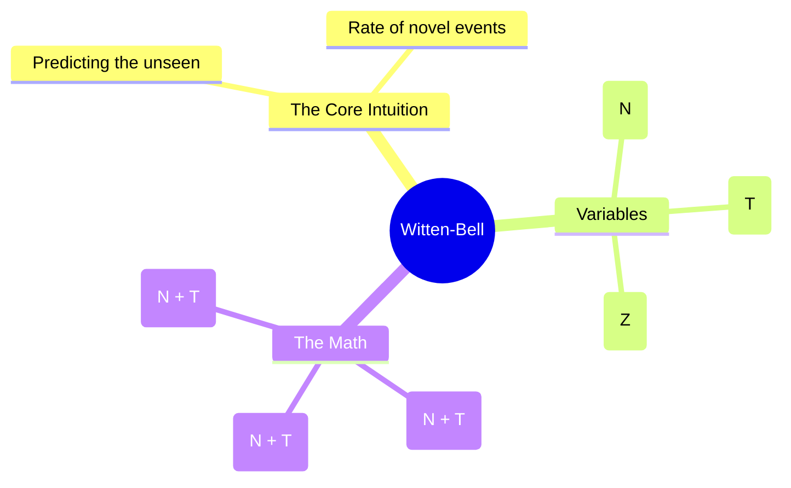

# 19. Witten-Bell Smoothing

## 1. Topic Overview
This module covers **Witten-Bell Smoothing**, an incredibly elegant discounting algorithm that estimates the probability of completely unseen words by modeling the specific rate at which *new, unique words* historically appeared in the training text.

## 2. Learning Path
1. [Witten-Bell Smoothing](witten-bell-smoothing.md)

## 3. Real-World Applications
- **Data Compression**: Witten-Bell smoothing was not originally invented for NLP; it was actually invented by Ian Witten and Timothy Bell for the text compression algorithm PPM (Prediction by Partial Matching). It was later adopted by NLP researchers because predicting the probability of the next character/word is exactly what text compression algorithms do.
- **Computational Simplicity**: Witten-Bell was historically favored as a major stepping stone toward modern state-of-the-art smoothing techniques because it is highly effective yet computationally much simpler than Good-Turing (it doesn't require calculating frequencies of frequencies $N_c$ or running log-linear regressions).

## 4. Difficulty & Importance
- **Mathematical Difficulty**: ★★☆☆☆ (Medium - The formulas are relatively simple, but calculating the variable $Z$ requires keeping careful track of the vocabulary size).
- **Implementation Difficulty**: ★☆☆☆☆ (Very Low - Basic fractional arithmetic).
- **Exam Importance**: **Medium-High**. Calculating Witten-Bell adjusted probabilities by hand using a tiny toy corpus is a very standard numerical exam question.

## 5. Prerequisites
- [16. Laplace & Add-k Smoothing](../16-laplace-and-add-k-smoothing/README.md) (Crucial: Understanding what Discounting is trying to achieve).

## 6. External Resources
- 📘 **Textbook**: *Speech and Language Processing* (Jurafsky & Martin), Chapter 3 (Historical Smoothing appendix).

---

### Can You Explain This?
- [ ] I can explicitly state the difference between Tokens ($N$) and Types ($T$).
- [ ] I can explain the mathematical logic behind modeling the total unseen probability mass as $T / (N+T)$.
- [ ] I can calculate Witten-Bell probabilities for both seen and unseen events given $N$, $T$, and $|V|$.
