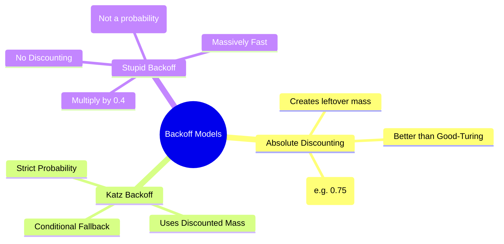

# 20. Backoff & Discounting

## 1. Topic Overview
This module explores **Backoff Algorithms**, a conditional alternative to Interpolation. It covers how we mechanically combine Backoff with **Absolute Discounting** to mathematically guarantee that all probabilities sum to exactly 1.0. Finally, it covers **Stupid Backoff**, a famous algorithm that throws away pure mathematical probability for the sake of massive computational speed.

## 2. Learning Path
1. [Backoff and Absolute Discounting](backoff-and-absolute-discounting.md)
2. [Katz and Stupid Backoff](katz-and-stupid-backoff.md)

## 3. Real-World Applications
- **Google's Translation Empire**: Stupid Backoff was the de-facto standard language modeling algorithm used by Google for large-scale systems (like Google Translate) before the deep learning revolution in the 2010s. Because it didn't require complex discounting math, Google was able to train the algorithm on trillions of words using massive server clusters, proving to the NLP world that *massive data scale often beats complex, elegant math.*

## 4. Difficulty & Importance
- **Mathematical Difficulty**: ★★★☆☆ (Medium - Understanding exactly how the leftover probability mass is generated and distributed can be tricky).
- **Implementation Difficulty**: ★★☆☆☆ (Low - Stupid Backoff is incredibly easy to code).
- **Exam Importance**: **High**. Calculating absolute discounted probabilities is a common numerical exam question, and Stupid Backoff is a favorite theory question.

## 5. Prerequisites
- [17. Interpolation](../17-interpolation/README.md) (Crucial: the difference between Interpolation and Backoff).
- [18. Good-Turing Smoothing](../18-good-turing-smoothing/README.md) (Crucial: understanding Discounting).

## 6. External Resources
- 📘 **Textbook**: *Speech and Language Processing* (Jurafsky & Martin), Chapter 3 (Historical).

---

### Can You Explain This?
- [ ] I can write the Absolute Discounting formula ($C^* = C - d$) and explain where $d$ comes from.
- [ ] I can conceptually explain the strict `if/else` logic of Katz Backoff.
- [ ] I can explain why "Stupid Backoff" is called "stupid" and why it does not produce a valid mathematical probability.
