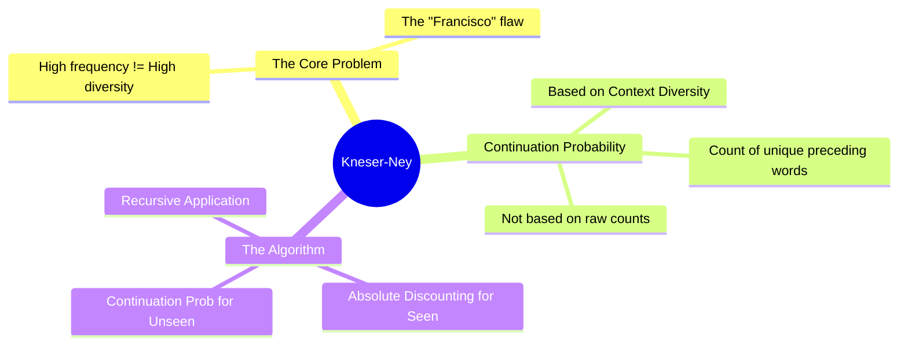

# 21. Kneser-Ney Smoothing

## 1. Topic Overview
This module introduces **Kneser-Ney Smoothing**, widely considered the absolute pinnacle, most mathematically effective, and most sophisticated classical smoothing algorithm ever invented for NLP. It radically alters the concept of Backoff by introducing a new statistical metric: **Continuation Probabilities (Context Diversity)**.

## 2. Learning Path
1. [Kneser-Ney Fundamentals](kneser-ney-fundamentals.md)
2. [Interpolated and Recursive Kneser-Ney](interpolated-and-recursive-kneser-ney.md)

## 3. Real-World Applications
- **The Classical State of the Art**: Before the invention of Word2Vec and modern Neural Networks around 2013 completely upended the field, Interpolated Kneser-Ney was the undisputed, dominant state-of-the-art algorithm for statistical Language Modeling. Understanding it is widely considered the "final boss" of classical NLP probability theory. 

## 4. Difficulty & Importance
- **Mathematical Difficulty**: ★★★★☆ (High - The recursive mathematical definitions and lambda normalizers can be very difficult to track mentally).
- **Implementation Difficulty**: ★★★★☆ (High - Building the specific context dictionary structures required for a fast, memory-efficient implementation is algorithmically complex).
- **Exam Importance**: **Medium-High**. Calculating the Continuation Probability for a specific word given a small table of toy bigrams is a standard advanced numerical exam question.

## 5. Prerequisites
- [17. Interpolation](../17-interpolation/README.md) (Crucial: How lambda weights distribute probability).
- [20. Backoff & Discounting](../20-backoff-and-discounting/README.md) (Crucial: How Absolute Discounting generates leftover mass).

## 6. External Resources
- 📘 **Textbook**: *Speech and Language Processing* (Jurafsky & Martin), Chapter 3.

---

### Can You Explain This?
- [ ] I can conceptually explain why high-frequency words can ruin traditional Backoff models (the "Francisco" problem).
- [ ] I can explicitly define what a "Continuation Count" measures.
- [ ] I can explain why Kneser-Ney abandons the raw Unigram MLE probability in favor of the Continuation Probability.
