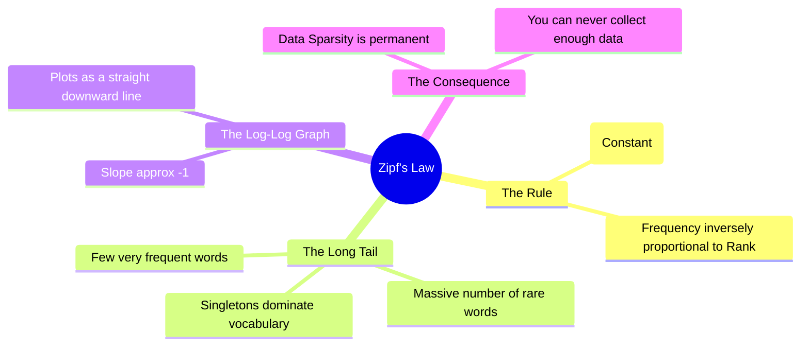

# 22. Zipf's Law & Frequency Distributions

## 1. Topic Overview
This module steps away from algorithms to cover **Zipf's Law**, the foundational empirical rule governing the fundamental nature of frequency distributions in human language. It mathematically proves why certain problems in NLP (like Out of Vocabulary words) are physically impossible to solve just by collecting more data.

## 2. Learning Path
1. [Zipf's Law and Frequency Distributions](zipfs-law.md)

## 3. Real-World Applications
- **Data Compression and Caching**: Software engineers use Zipf's law to optimize server caches and compression algorithms. Because a tiny fraction of words (or search queries) make up the vast majority of traffic, caching just the top 100 most frequent queries can dramatically reduce server load.
- **Search Engine Indexing**: Search engines like Google use Zipf distributions to identify and ignore "stop words" (like "the", "and") which appear on almost every webpage and carry zero distinguishing search value.

## 4. Difficulty & Importance
- **Mathematical Difficulty**: ★☆☆☆☆ (Very Low - The formula relies entirely on basic multiplication and division).
- **Implementation Difficulty**: ★☆☆☆☆ (Very Low).
- **Exam Importance**: **Medium-High**. Calculating the mathematically expected frequency of a word given its rank and the frequency of the top-ranked word is a highly common, easy 2-mark exam question.

## 5. Prerequisites
- [15. Sparsity & Zero-Probability Problem](../15-sparsity-and-zero-probability-problem/README.md) (Crucial: Understanding why Data Sparsity exists).

## 6. External Resources
- 📘 **Textbook**: *Speech and Language Processing* (Jurafsky & Martin), Chapter 2.

---

### Can You Explain This?
- [ ] I can write the core mathematical formula for Zipf's Law.
- [ ] I can explicitly define what the "Long Tail" means in a linguistic distribution.
- [ ] I can explain mathematically why plotting Zipf's Law in Log-Log space yields a straight line.
- [ ] I can explain why Zipf's law proves that collecting a trillion words of text will not solve the Out-Of-Vocabulary problem.
