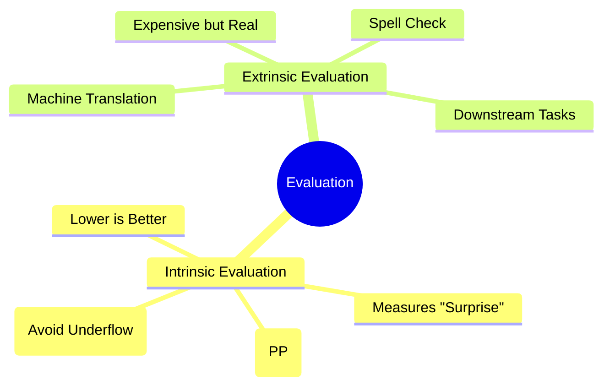

# 23. Perplexity & Language Model Evaluation

## 1. Topic Overview
This module explains the critical science of how we objectively measure and mathematically compare the quality of different statistical language models. It covers **Intrinsic Evaluation** (using the mathematical metric of Perplexity) and **Extrinsic Evaluation** (measuring how the model performs on real-world downstream tasks).

## 2. Learning Path
1. [Perplexity and Log Probabilities](perplexity-and-log-probabilities.md)
2. [Intrinsic vs Extrinsic Evaluation](evaluation-methods.md)

## 3. Real-World Applications
- **Algorithmic Benchmarking**: You cannot improve what you cannot mathematically measure. If you write a brand new smoothing algorithm, the only way to scientifically prove to the NLP community that it is better than Kneser-Ney is to evaluate both models on a massive, unseen test set and mathematically prove that your model achieves a significantly lower Perplexity score.

## 4. Difficulty & Importance
- **Mathematical Difficulty**: ★★★☆☆ (Medium - Requires an understanding of negative exponents, $N$th roots, and why log arithmetic is used to prevent computer underflow).
- **Implementation Difficulty**: ★☆☆☆☆ (Very Low - Calculating perplexity in code is just a few lines of math).
- **Exam Importance**: **Extremely High**. Calculating the exact Perplexity of a toy sentence given the probabilities of its constituent words is a guaranteed, classic numerical exam question.

## 5. Prerequisites
- [14. N-gram Language Models](../14-n-gram-language-models/README.md) (Crucial: How sentence probability is calculated via the Chain Rule).
- [15. Sparsity & Zero-Probability Problem](../15-sparsity-and-zero-probability-problem/README.md) (Crucial: Understanding why $P=0$ breaks the Perplexity equation).

## 6. External Resources
- 📘 **Textbook**: *Speech and Language Processing* (Jurafsky & Martin), Chapter 3.

---

### Can You Explain This?
- [ ] I can write the exact mathematical formula for Perplexity using an $N$th root.
- [ ] I can explicitly state whether a *higher* or *lower* Perplexity score is better, and why.
- [ ] I can explain what a "floating-point underflow" is and why we must use Log Probabilities to fix it.
- [ ] I can explain the conceptual difference between Intrinsic and Extrinsic evaluation.
