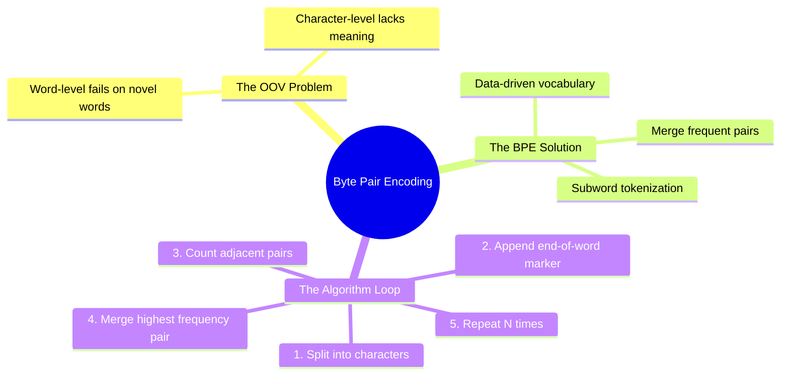

# 24. Byte Pair Encoding (BPE)

## 1. Topic Overview
This module explores **Byte Pair Encoding (BPE)**, a revolutionary subword tokenization algorithm. Originally designed as a data compression technique in 1994, it was adapted for NLP to definitively solve the Out Of Vocabulary (OOV) problem. It is currently the foundational text processing algorithm used by almost every modern Large Language Model (including GPT-4 and LLaMA).

## 2. Learning Path
1. [Byte Pair Encoding (BPE) Fundamentals](bpe-fundamentals.md)
2. [BPE Implementation and Alternatives](bpe-implementation-and-alternatives.md)

## 3. Real-World Applications
- **Modern Large Language Models (LLMs)**: When you type a prompt into ChatGPT, the text is not fed into the neural network as whole words. It is tokenized using a variant of BPE (specifically `tiktoken` for OpenAI models). This allows the model to instantly understand novel words, typos, and highly complex technical jargon by breaking them down into recognizable, frequently seen subword "chunks" (like `"sub"`, `"word"`, and `"ization"`).

## 4. Difficulty & Importance
- **Mathematical Difficulty**: ★☆☆☆☆ (Very Low - Requires absolutely no advanced math, just basic counting and finding the maximum value).
- **Implementation Difficulty**: ★★★☆☆ (Medium - Writing the string replacement logic in Python requires being very careful with string spaces and token boundaries).
- **Exam Importance**: **Extremely High**. BPE is the absolute foundation of modern NLP text processing. A question instructing you to "Perform 3 manual iterations of BPE on the following toy corpus" is a highly standard, guaranteed exam question.

## 5. Prerequisites
- [03. Tokenization](../03-tokenization/README.md) (Crucial: Understanding the basic concept of breaking text into tokens).

## 6. External Resources
- 📘 **Textbook**: *Speech and Language Processing* (Jurafsky & Martin), Chapter 2.4.

---

### Can You Explain This?
- [ ] I can explicitly define the fatal flaws of both pure word-level tokenization and pure character-level tokenization.
- [ ] I can explain why the `</w>` token is mathematically necessary at the end of words before running BPE.
- [ ] I can manually perform 3 iterations of BPE on a simple toy corpus.
- [ ] I can describe the primary algorithmic difference between BPE and WordPiece.
