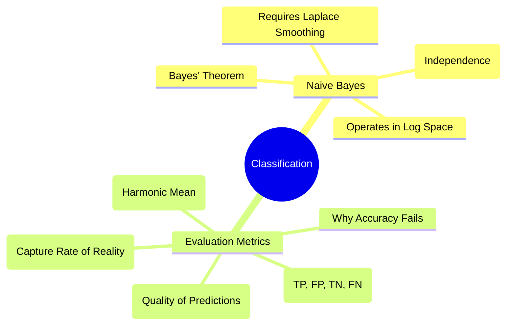

# 25. Text Classification

## 1. Topic Overview
This module introduces the massive real-world application of **Supervised Text Classification**. It covers the classical, highly effective **Naive Bayes** algorithm for text categorization, and the universally standard evaluation metrics (Precision, Recall, F1-Score) used by data scientists to rigorously grade the performance of classification models.

## 2. Learning Path
1. [Text Classification and Naive Bayes](classification-and-naive-bayes.md)
2. [Evaluation Metrics: Precision, Recall, and F1](evaluation-metrics.md)

## 3. Real-World Applications
- **Spam Filtering**: Automatically detecting and categorizing emails as "Spam" or "Not Spam" based on the statistical probabilities of the words they contain.
- **Support Ticket Routing**: Analyzing the text of an angry customer email and automatically assigning it to the "Billing", "Technical Support", or "Sales" bucket.
- **Toxicity Detection**: Automatically flagging and hiding extremely toxic or abusive comments on social media platforms.

## 4. Difficulty & Importance
- **Mathematical Difficulty**: ★★★☆☆ (Medium - Requires conceptually combining log probabilities and understanding how to calculate harmonic means).
- **Implementation Difficulty**: ★★★☆☆ (Medium - Tracking specific vocabularies and class counts across multiple nested dictionaries in Python can be slightly tricky).
- **Exam Importance**: **Extremely High**. Calculating $P(Class \mid Document)$ by hand, and calculating Precision, Recall, and F1 from a Confusion Matrix are guaranteed to be on almost any NLP or Machine Learning exam.

## 5. Prerequisites
- [12. TF-IDF & Vector Semantics](../12-tf-idf-and-vector-semantics/README.md) (Crucial: How to represent documents as bags of words).
- [13. Probability Foundations](../13-probability-foundations/README.md) (Crucial: Bayes' Theorem).
- [16. Laplace & Add-k Smoothing](../16-laplace-and-add-k-smoothing/README.md) (Crucial: Solving zero-probability crashes).

## 6. External Resources
- 📘 **Textbook**: *Speech and Language Processing* (Jurafsky & Martin), Chapter 4.

---

### Can You Explain This?
- [ ] I can explain mathematically what the "naive" independence assumption is in Naive Bayes.
- [ ] I can explain why Laplace Smoothing is strictly required for Naive Bayes.
- [ ] I can explicitly define Precision and Recall.
- [ ] I can mathematically explain why basic Accuracy fails catastrophically on highly imbalanced datasets.
